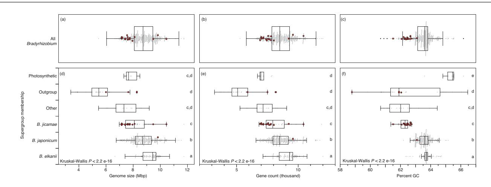
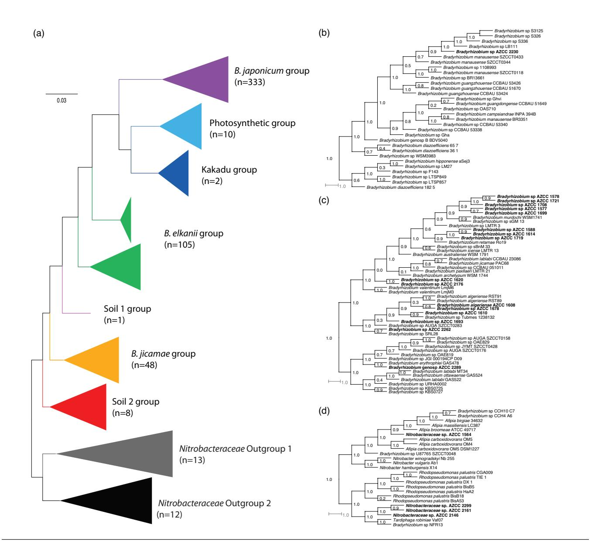

# High-quality PacBio draft genome sequences of 17 free-living *Bradyrhizobium* and four related *Nitrobacteraceae* strains isolated from arid soils in the Santa Catalina Mountains of Southern Arizona

Melanie R. Kridler1 , Amanda Howe1 , Jimaree A. Legins2 , Christina Guerrero1 , Ryan P. Bartelme1 , Bridget Taylor1 and Paul Carini1,3, \*

*Access Microbiology* is an open research platform. Pre-prints, peer review reports, and editorial decisions can be found with the online version of this article. Received 22 July 2024; Accepted 02 December 2024; Published 13 February 2025

Author affiliations: 1 Department of Environmental Science, University of Arizona, Tucson, AZ, USA; 2 Arizona Biological and Biomedical Sciences Program, University of Arizona, Tucson, AZ 85721, USA; 3 BIO5 Institute, University of Arizona, Tucson, AZ 85721, USA.

#### Abstract

Non-symbiotic *Bradyrhizobium* are among the most abundant and ubiquitous microbes in bulk soils globally. Despite this, most available genomic resources for *Bradyrhizobium* are derived from plant-associated strains. We present high-quality draft genomes for 17 *Bradyrhizobium* and four *Nitrobacteraceae* cultures isolated from bulk semiarid soils in Arizona, USA. The genome sizes range from 5.99 to 10.4 Mbp. Phylogenomic analysis of the 21 genomes indicates they fall into four clades. Two of the clades are nested within the *Bradyrhizobium* genus. The other two clades were associated with *Nitrobacteraceae* outgroups basal to *Bradyrhizobium*. All genomes lack genes coding for molybdenum or vanadium nitrogenases, and *nod* genes that code for proteins involved in nodulation, suggesting these isolates are free-living, non-symbiotic and do not fix dinitrogen gas. These genomes offer new resources for investigating free-living *Bradyrhizobium* lineages.

Most available *Bradyrhizobium* genome sequences are derived from symbiotic lineages that nodulate leguminous plants. Here we report the genome sequences for 17 *Bradyrhizobium* and four *Nitrobacteraceae* strains isolated from bulk soil, and their phylogenetic context. None of the genomes code for nitrogenase or nodulation genes, suggesting they are non-diazotrophic, non-symbiotic free-living soil bacteria. This work adds new genomic resources that can be used to investigate the role of nonsymbiotic soil *Bradyrhizobium* in soil biogeochemistry.

# **Data Summary**

All genome accessions are reported in [Table 1](#page-1-0). All taxa used in the phylogenomic reconstructions and corresponding Integrated Microbial Genomics (IMG) Genome identifiers and statistics are listed in Table S1, available in the online version of this article. Genome sequences are available in both NCBI (<https://www.ncbi.nlm.nih.gov/>) and IMG [\[1](#page-6-0)].

## **Introduction**

*Bradyrhizobium* are abundant globally distributed soil microbes [[2, 3](#page-6-1)]. These cosmopolitan alphaproteobacteria are primarily known for their role in symbiotic nitrogen fixation with leguminous plants [\[4\]](#page-6-2). Yet, many, and perhaps most, soil *Bradyrhizobium* are free-living and non-symbiotic [\[2, 5, 6\]](#page-6-1). The genomes of *Bradyrhizobium* are evolutionarily complex, and code for metabolically diverse functions [\[7–11\]](#page-6-3). Despite their abundance, the genomics and physiologies of non-symbiotic *Bradyrhizobium* in bulk

\*Correspondence: Paul Carini, paulcarini@arizona.edu Keywords: nitrogen fixation; non-symbiotic; soil bacteria.

Abbreviations: AZCC, Arizona Culture Collection; gDNA, genomic DNA; HEPES, 4-(2-hydroxyethyl)−1-piperazineethanesulfonic acid; IMG, integrated microbial genomics; JGI, Joint Genome Institute; KO, KEGG orthology; MES, 2-(N-morpholino)ethanesulfonic acid; OR, Oracle Ridge; OTUs, operational taxonomic units; YM, yeast mannitol.

Table 1. Genome summary statistics, taxonomy and isolation information

soils are still largely unexplored [\[7, 9](#page-6-3)]. Here, we report 21 new high-quality draft PacBio genomes of putatively non-symbiotic non-diazotrophic *Bradyrhizobium* and *Nitrobacteraceae* strains isolated from shallow subsurface soils in the Santa Catalina Mountains of Southern Arizona.

## **Methods**

#### **Culture isolation**

Soil samples were collected from Catalina Mountain Critical Zone Observatory field sites in May 2018: Oracle Ridge (OR) and Biosphere 2 (B2; [Table 1\)](#page-1-0). Soils were kept cool on wet ice for <24h during transport to the laboratory. We homogenised soils in sterile water with an immersion blender (10 g of 2 mm-sieved soil in 100 g water) and serially diluted them in sterile water (10-fold). Dilutions (100µl) were plated on solid 20% Yeast Mannitol (YM) medium, consisting of (l−1) 0.2 g yeast extract, 2.0 g mannitol, 0.1 g K2 HPO4 , 0.04 g MgSO4 , 0.02 g NaCl, 0.2 g CaCO3 , solidified with 15 g Noble Agar (HiMedia, Kennett Square, PA). We used 20% YM instead of full strength to improve the isolation of oligotrophic microbes. Plates were incubated at 25 °C for 6weeks. Isolated colonies from dilutions displaying isolated colonies were picked and used to inoculate arrays of deep-well 96-well plates containing 20% YM broth and incubated at 25 °C for 6weeks.

## **Culture identification**

The arrayed cultures were identified and screened for *Bradyrhizobium*. The cultures were identified with a direct PCR of each well amplifying the V4–V5 region of the 16S rRNA gene using barcoded 515F and 806R primer pairs coupled with Illumina sequencing. Briefly, for each well, we amplified 16S rRNA genes in 25µl PCR reactions containing 12.5µl of Promega GoTaq Hot Start Colourless Master Mix; 0.5µl of each 10µM primer (bacterial 16S: 515F 5′-GTGCCAGCMGCCGCGGTAA-3′ and 806R 5′-GGACTACHVGGGTWTCTAAT-3′ [\[12](#page-6-4)]); 10.5µl water; and 1µl of cell culture from the arrayed 96-well plates as template DNA. Each well contained a unique barcoded 515F primer. The thermal cycler programme was 94 °C for 5min, followed by 35 cycles (94 °C 45 s; 50 °C 60 s; 72 °C 90 s) and a final extension at 72 °C 10min. Products were cleaned and normalised using the ThermoFisher Scientific SequalPrep Normalization Plate. Cleaned and normalised amplicons were pooled, spiked with 15% phiX and sequenced on an Illumina MiSeq using v2 500-cycle paired-end kits per the manufacturer's instructions. Reads were processed into Operational Taxonomic Units (OTUs) and classified as described previously [\[13](#page-6-5)]. Wells enriched in *Bradyrhizobium* (≥75% reads matching an OTU classified as *Bradyrhizobium*) were streaked to purity on 20% YM plates. Pure cultures of *Bradyrhizobium* were verified by direct PCR using a portion of a single colony as template DNA by amplifying and Sanger sequencing the full-length 16S rRNA genes using the 27F-1492R primer set (27F, 5′-AGAGTTTGATCMTGGCTCAG-3′; 1492R, 5′-TACCTTGTTACGACTT-3′) as described previously [\[13, 14](#page-6-5)]. The resulting amplicons were cleaned and Sangersequenced by Eurofins Genomics (Louisville, KY). This resulted in 63 *Bradyrhizobium*-related cultures that are part of the Arizona Culture Collection (AZCC) housed by the Carini lab at the University of Arizona. A subset of bacterial strains from the Carini lab collection at the University of Arizona were selected for full genome sequencing at the Joint Genome Institute (JGI). These strains were chosen based on robust growth characteristics and their origins across the different sites and depths. We included several strains from the same site-depth combinations to investigate genomic differences in cohabitating populations. The species names of the AZCC genomes were based on the blast [\[15\]](#page-6-6) best-hit of the 16S rRNA gene sequences.

## **Culture scaling for genomic DNA and DNA isolation**

Isolated *Bradyrhizobium* colonies were used to inoculate 'ATCC medium: 2233 Modified Arabinose Gluconate Medium' containing (l−1) 1.3 g 4-(2-hydroxyethyl)-1-piperazineethanesulfonic acid (HEPES), 1.1 g 2-(N-morpholino)ethanesulfonic acid (MES), 0.0067 g FeCl3 ·6H2 O, 0.018 g MgSO4 ·7H2 O, 0.013 g CaCl2 ·2H2 O, 0.25 g Na2 SO4 , 0.32 g NH4 Cl, 0.125 g Na2 HPO4 , 1 g l-arabinose, 1 g gluconate and 1 g yeast extract. Cultures were incubated at 25 °C with shaking at 180 r.p.m. until visually turbid (2–3weeks). Cells were collected by centrifugation (5000×*g* for 10min) and the supernatant was removed. DNA was extracted from pellets with a Qiagen Blood and Tissue Kit with the Gram-negative bacterial pre-treatment as recommended by the manufacturer. DNA quantity and quality were analysed using the Thermo Scientific Qubit Fluorometer and agarose gel electrophoresis, respectively.

## **Genome sequencing and annotation**

Genomic DNA (gDNA) was sequenced at the JGI using their in-house sequencing protocols. In brief, 1000ng of gDNA was sheared around 10 kb using the g-TUBE (Covaris). The sheared gDNA was treated with exonuclease to remove single-stranded ends, DNA damage repair enzyme mix, end-repair/A-tailing mix and ligated with barcoded overhang adapters using SMRTbell Express Template Prep Kit 2.0 (PacBio). Libraries were pooled and purified with AMPure PB Beads (PacBio). PacBio Sequencing primer was then annealed to the SMRTbell template library and sequencing polymerase was bound to them using Sequel II Binding kit 2.0. The prepared SMRTbell template libraries were sequenced on a Pacific Biosystems' Sequel IIe sequencer using SMRT Link 10.2, 8M v1 SMRT cells and Version 2.0 sequencing chemistry with 900min sequencing movie run times. Genomes were assembled with Flye (v. 2.8.3) [[16\]](#page-6-7) and annotated using the prokaryotic genome annotation pipeline (v. 6.6) [[17](#page-6-8)]. Additionally, annotations are available in the comparative analysis system IMG/MER [\[1](#page-6-0)].

#### **Phylogenomic analysis**

To place the new AZCC genomes in a phylogenetic context of existing *Bradyrhizobium*, we downloaded all *Bradyrhizobium* genomes available as of 1 September 2023, from the JGI IMG web portal [[1](#page-6-0)] using '*Bradyrhizobium'* as a search query. We examined the downloaded genomes and discarded genomes that appeared to be incomplete. These excluded genomes were assembled from metagenomic data or single-cell amplified genomes. The remaining *Bradyrhizobium* dataset consisted of 489 genomes (Table S1). Additionally, we downloaded the following 21 taxa to construct the outgroup, as reported in [\[9](#page-6-9)]: *Bradyrhizobium* sp CCH10 C7, *Bradyrhizobium* sp CCH4 A6, *Afipia birgiae* 34632, *A. massiliensis* LC387, *A. broomeae* ATCC 49717, *A. carboxidovorans* OM5, *A. carboxidovorans* OM4, *A. carboxidovorans* OM5 DSM 1227, *Bradyrhizobium* sp U87765 SZCCT0048, *Nitrobacter winogradskyi* Nb 255, *N. vulgaris* Ab1, *N. hamburgensis* X14, *Rhodopseudomonas palustris* CGA009, *R. palustris* TIE 1, *R. palustris* DX 1. *R. palustris* BisB5, *R. palustris* HaA2, *R. palustris* BisB18, *R. palustris* BisA53, *Tardiphaga robiniae* Vaf07 and *Bradyrhizobium* sp NFR13 (Table S1).

Using the Anvi'o (v. 7.1) phylogenomics workflow [[18\]](#page-6-10), we investigated the phylogenomic relationships among 529 genomes encompassing the *Bradyrhizobium* genomes, new AZCC genomes reported in this study and outgroup taxa. The tree was constructed using anvi-gen-phylogenomic-tree in Anvi'o, which uses FastTree (v. 2.1.10) to reconstruct phylogenetic relationships [[18, 19\]](#page-6-10). The tree was based on the following concatenated ribosomal protein amino acid sequences: Ribosomal L1, L13, L14, L16, L17, L18p, L19, L2, L20, L21p, L22, L23, L27, L27A, L28, L29, L3, L32p, L35p, L4, L5, L6, L9 C, S10, S11, S13, S15, S16, S17, S19, S2, S20p, S3 C, S6, S7, S8 and S9 as identified with the Bacteria 71 HMM source in Anvi'o [[18, 20\]](#page-6-10). The concatenated sequences were aligned with Muscle v5 [[21](#page-6-11)].

Genomes were manually classified into *Bradyrhizobium* supergroups defined previously [\[9\]](#page-6-9) after phylogenomic analysis. For genome statistics presented in [Fig. 1](#page-3-0), the supergroups Soil 1–3, Kakadu and taxa that did not cluster with established supergroups were combined in the 'Other' category.

### **Nitrogenase and nodulation gene identification**

We searched the genomes for genes annotated as orthologous to the KEGG Orthology numbers for nitrogenase (*nif*, *vnf*), and nodulation factors (*nod*) in IMG/ER ([Table 2](#page-4-0)) [\[1](#page-6-0)].

# **Results and discussion**

#### **Sequencing statistics**

The number of raw reads generated per genome ranged from 20 693 to 106 707 with a mean of 73 675 ± 23 136 (mean ± SD reads; [Table 1\)](#page-1-0). The mean contig N50 ranged from 6 to 10.5 Mbp (mean 7.8 ± 1.0Mbp; [Table 1](#page-1-0)). Each genome is assembled into a single scaffold.

Fig. 1. Genome statistics for 21 new AZCC isolates in the context of sequenced *Bradyrhizobium* genomes and select outgroup taxa. Points are the individual measurements of genome size, number of genes or percent guanine and cytosine (GC) for the 529 genomes included in this study. Red points are the new AZCC genomes reported here. Grey points are for existing genome sequence data. Panels (a–c) show taxa clustering within the *Bradyrhizobium* genus in [Fig. 1.](#page-3-0) Panels (e–f) assign genomes to *Bradyrhizobium* and outgroup lineages as explained previously [\[9\]](#page-6-9), see methods for details. Box plots illustrate interquartile range ± 1.5×interquartile range. The horizontal line in each box plot is the median. Outliers (>1.5 × interquartile range) are shown as points outside brackets. Kruskal-Wallis tests indicated significant variability (Kruskal–Wallis *P* < 0.05) in genome size (d), gene count (e) and per cent GC (f) across supergroups. Box plots sharing letters are statistically indistinguishable by Dunn's test (Bonferroni-corrected *P*value > 0.05).

### **Phylogenomic placement**

Phylogenomic analysis confirmed the placement of 17 of the 21 genomes within the *Bradyrhizobium* genus [\(Fig. 2](#page-5-0)). *Bradyrhizobium sp*. AZCC 2230 was the sole genome that clustered within the previously described *B. japonicum* supergroup ([Fig. 2a, b](#page-5-0)) [\[9](#page-6-9)]. Most (16 of 17) *Bradyrhizobium* strains belonged to the *B. jicamae* supergroup [\(Fig. 2a, c](#page-5-0)), including *Bradyrhizobium* spp., strains AZCC 1577, AZCC 1587, AZCC 1588, AZCC 1608, AZCC 1610, AZCC 1614, AZCC 620, AZCC 1678, AZCC 1693, AZCC 1699, AZCC 1708, AZCC 1719, AZCC 1721, AZCC 2176, AZCC 2262 and AZCC 2289 [\(Fig. 2a, c\)](#page-5-0). Unexpectedly, four genomes clustered with the outgroup taxa included in our analyses ([Fig. 2a, d\)](#page-5-0). For example, strain AZCC 1564 clustered closely with *Afipia* isolates, while strains AZCC 2299, AZCC 2161 and AZCC 2146 clustered in a sister clade to *Rhodopseudomonas* and share an ancestor with *Tardiphaga* [\(Fig. 2a, d](#page-5-0)). We refer to the four strains clustering with outgroup lineages as *Nitrobacteraceae* spp. herein.

#### **Genome statistics**

The average genome size across the new AZCC genomes was 7.87 ± 0.99Mbp (mean ± SD) and ranged from 5.99 Mbp (AZCC 1564) to 10.4 Mbp (AZCC 2289) (Table S1). The mean genome size of the *Bradyrhizobium* AZCC genomes was 7.95 ± 0.99Mbp ([Fig. 1](#page-3-0)a). Most AZCC *Bradyrhizobium* genomes were between 7 and 8 Mbp long and are among the smallest *Bradyrhizobium* genomes reported ([Fig. 1](#page-3-0)a). However, three AZCC genomes were >9Mbp long. Two of these belonged to the *B. jicamae* supergroup (AZCC 2262 and AZCC 2289) and one to the *B. japonicum* supergroup (AZCC 2230; [Fig. 1a and d\)](#page-3-0). While *B. jicamae* supergroup genomes are typically significantly smaller than those in the *B. japonicum* and *B. elkanii* supergroups (Dunn's test Bonferronicorrected *P* < 0.05), AZCC strains 2262 and 2289 are among the largest sequenced genomes in the *B. jicamae* supergroup. Similarly, the AZCC 2230 genome is larger than the mean genome lengths in the *B. japonicum* supergroup.

As expected, the differences in *Bradyrhizobium* AZCC strain genome lengths were mirrored in the number of genes in each genome. The mean number of genes in the *Bradyrhizobium* AZCC genomes was 7807 ± 1001 genes (mean ± SD). This large degree of variability in the number of genes underscores the high variation in genetic inventories found in cohabitating free-living *Bradyrhizobium* populations. Future comparative genomic analyses among these strains are necessary to determine the functional significance of the differences in genetic inventories.

The mean per cent GC content for the AZCC *Bradyrhizobium* genomes was 62.4±0.33% (mean±SD) (Table S1) and under the median per cent, GC of all *Bradyrhizobium* genomes analysed. This result may be skewed by most new AZCC genomes belonging to the *B. jicamae* supergroup, which have a significantly lower mean per cent GC than the *B. japonicum*, *B elkanii* or photosynthetic *Bradyrhizobium* supergroups (Dunn's test Bonferroni-corrected *P* < 0.05).

Table 2. Distribution of KEGG Orthology (KO) genes associated with nitrogenase and nodulation in AZCC genomes

| KO entry | Symbol | Name                                                                               | AZCC genomes |
|----------|--------|------------------------------------------------------------------------------------|--------------|
| K02586   | nifD   | Nitrogenase molybdenum-iron protein alpha chain                                    | Absent       |
| K02587   | nifE   | Nitrogenase molybdenum-cofactor synthesis protein NifE                             | Absent       |
| K02588   | nifH   | Nitrogenase iron protein NifH                                                      | Absent       |
| K02591   | nifK   | Nitrogenase molybdenum-iron protein beta chain                                     | Absent       |
| K02592   | nifN   | Nitrogenase molybdenum-iron protein NifN                                           | Absent       |
| K02595   | nifW   | Nitrogenase-stabilising/protective protein                                         | Absent       |
| K22896   | vnfD   | Vanadium-dependent nitrogenase alpha chain                                         | Absent       |
| K22897   | vnfK   | Vanadium-dependent nitrogenase beta chain                                          | Absent       |
| K22898   | vnfG   | Vanadium nitrogenase delta subunit                                                 | Absent       |
| K22899   | vnfH   | Vanadium nitrogenase iron protein                                                  | Absent       |
| K22903   | vnfE   | Nitrogenase vanadium-cofactor synthesis protein VnfE                               | Absent       |
| K14658   | nodA   | Nodulation protein A                                                               | Absent       |
| K14659   | nodB   | Chitooligosaccharide deacetylase                                                   | Absent       |
| K14666   | nodC   | N-acetylglucosaminyltransferase                                                    | Absent       |
| K14657   | nodD   | LysR family transcriptional regulator, nod-box dependent transcriptional activator | Present      |

#### **General genome features**

All genomes contained a single rRNA operon coding for a 5S, 16S and 23S rRNA. *Bradyrhizobium* is well-known to be involved in a nitrogen-fixing symbiosis with leguminous plants. None of the genomes presented here code for predicted open reading frames annotated as Mo or Va nitrogenases (*nifDEHKNW* or *vnfDKGHE*, respectively), or core nodulation genes (*nodABC*; [Table 2\)](#page-4-0). All genomes code for a predicted *nodD*, a transcriptional regulator ([Table 2\)](#page-4-0). The lack of core *nif* and *nod* machinery in a high-quality draft genome assembly strongly suggests these isolates are free-living non-symbiotic strains.

# **Conclusion**

These 21 new genomes nearly double the number of genomic resources available to investigate the evolution and ecology of non-diazotrophic, free-living *Bradyrhizobium* and related lineages. Additionally, they add to the growing list of genomes available from microbes isolated from semiarid soils in southern Arizona [[22](#page-6-12)]. Collectively, these genomes, and the cultures they came

Fig. 2. Phylogenomic relationships of the 21 AZCC isolates among sequenced *Bradyrhizobium* and *Nitrobacteraceae*. FastTree is based on 37 concatenated ribosomal protein amino acid sequences. Node labels are FastTree local support values, (a) all 529 genomes in this study. The branches are coloured and labelled by the supergroups defined in [[9](#page-6-9)]. The number of genomes included in each collapsed group is listed in parentheses. Sub-trees of the *B. japonicum* supergroup (b), the *B. jicamae* supergroup (c) and the outgroup taxa (d) show the placement of the new AZCC strains (AZCC strains in bold).

from, can be used to experimentally identify how genetic microdiversity influences phenotypic variation across environmental stressors in the American Southwest.

#### Funding information

Funding from this work came from startup funds provided to P.C. from the University of Arizona's Technology and Research Initiative Fund (the Water, Environmental and Energy Solutions initiative), seed grants from the University of Arizona Centre for Environmentally Sustainable Mining and College of Agriculture and Life Sciences. With outside funding from the National Science Foundation (IOS-2141605 to P.C.) and a Simons Foundation Early Career Investigator in Marine Microbial Ecology and Evolution Award to P.C (929716). The work (proposal: [10.46936/10.25585/60000446](https://www.osti.gov/award-doi-service/biblio/10.46936/10.25585/60000446)) conducted by the U.S. Department of Energy Joint Genome Institute [\(https://ror.org/04xm1d337](https://ror.org/04xm1d337)), a DOE Office of Science User Facility, is supported by the Office of Science of the U.S. Department of Energy operated under Contract No. DE-AC02-05CH11231.

#### Acknowledgements

We acknowledge Ray Sanchez, Isabella Viney and Bradley Schlottman for assistance with the experiments.

#### Author contributions

Writing: M.K., P.C. Experiments: A.H., C.G., B.T., P.C. Data analysis: J.L., R.B., P.C.

#### Conflicts of interest

The authors declare that there are no conflicts of interest.

- References
- 1. Chen I-M, Chu K, Palaniappan K, Ratner A, Huang J, *et al*. The IMG/M data management and analysis system v.7: content updates and new features. *Nucleic Acids Res* 2023;51:D723–D732.
- 2. VanInsberghe D, Maas KR, Cardenas E, Strachan CR, Hallam SJ, *et al*. Non-symbiotic *Bradyrhizobium* ecotypes dominate North American forest soils. *ISME J* 2015;9:2435–2441.
- 3. Delgado-Baquerizo M, Oliverio AM, Brewer TE, Benavent-González A, Eldridge DJ, *et al*. A global atlas of the dominant bacteria found in soil. *Science* 2018;359:320–325.
- 4. Poole P, Ramachandran V, Terpolilli J. Rhizobia: from saprophytes to endosymbionts. *Nat Rev Microbiol* 2018;16:291–303.
- 5. Jones FP, Clark IM, King R, Shaw LJ, Woodward MJ, *et al*. Novel European free-living, non-diazotrophic *Bradyrhizobium* isolates from contrasting soils that lack nodulation and nitrogen fixation genes - a genome comparison. *Sci Rep* 2016;6:25858.
- 6. Hollowell AC, Regus JU, Gano KA, Bantay R, Centeno D, *et al*. Epidemic spread of symbiotic and non-symbiotic *Bradyrhizobium* genotypes across California. *Microb Ecol* 2016;71:700–710.
- 7. Tao J, Wang S, Liao T, Luo H. Evolutionary origin and ecological implication of a unique nif island in free-living *Bradyrhizobium* lineages. *ISME J* 2021;15:3195–3206.
- 8. Tian CF, Zhou YJ, Zhang YM, Li QQ, Zhang YZ, *et al*. Comparative genomics of rhizobia nodulating soybean suggests extensive recruitment of lineage-specific genes in adaptations. *Proc Natl Acad Sci U S A* 2012;109:8629–8634.
- 9. Avontuur JR, Palmer M, Beukes CW, Chan WY, Coetzee MPA, *et al*. Genome-informed *Bradyrhizobium* taxonomy: where to from here? *Syst Appl Microbiol* 2019;42:427–439.
- 10. Simonsen AK. Environmental stress leads to genome streamlining in a widely distributed species of soil bacteria. *ISME J* 2022;16:423–434.
- 11. Weisberg AJ, Rahman A, Backus D, Tyavanagimatt P, Chang JH, *et al*. Pangenome evolution reconciles robustness and instability of rhizobial symbiosis. *mBio* 2022;13:e0007422.
- 12. Apprill A, McNally S, Parsons R, Weber L. Minor revision to V4 region SSU rRNA 806R gene primer greatly increases detection of SAR11 bacterioplankton. *Aquat Microb Ecol* 2015;75:129–137.
- 13. Bartelme RP, Custer JM, Dupont CL, Espinoza JL, Torralba M, *et al*. Influence of substrate concentration on the culturability of heterotrophic soil microbes isolated by high-throughput dilutionto-extinction cultivation. *mSphere* 2020;5:e00024-20.
- 14. Lane DJ. 16S/23S rRNA Sequencing. In: Stackebrandt E and Goodfellow M (eds). *Nucleic Acid Techniques in Bacterial Systematic*. New York: John Wiley and Sons; 1991. pp. 115–175.
- 15. Altschul SF, Gish W, Miller W, Myers EW, Lipman DJ. Basic local alignment search tool. *J Mol Biol* 1990;215:403–410.
- 16. Kolmogorov M, Yuan J, Lin Y, Pevzner PA. Assembly of long, error-prone reads using repeat graphs. *Nat Biotechnol* 2019;37:540–546.
- 17. Tatusova T, DiCuccio M, Badretdin A, Chetvernin V, Nawrocki EP, *et al*. NCBI prokaryotic genome annotation pipeline. *Nucleic Acids Res* 2016;44:6614–6624.
- 18. Eren AM, Kiefl E, Shaiber A, Veseli I, Miller SE, *et al*. Communityled, integrated, reproducible multi-omics with anvi'o. *Nat Microbiol* 2021;6:3–6.
- 19. Price MN, Dehal PS, Arkin AP. FastTree 2--approximately maximum-likelihood trees for large alignments. *PLoS One* 2010;5:e9490.
- 20. Lee MD. GToTree: a user-friendly workflow for phylogenomics. *Bioinformatics* 2019;35:4162–4164.
- 21. Edgar RC. Muscle5: high-accuracy alignment ensembles enable unbiased assessments of sequence homology and phylogeny. *Nat Commun* 2022;13:6968.
- 22. Kridler MR, Viney IA, Custer JM, Schlottman B, Bartelme R, *et al*. Draft genome sequences of *Arthrobacter* sp. AZCC\_0090 and *Mycobacterium* sp. AZCC\_0083 isolated from oligotrophic subsurface forest soil in the Santa Catalina mountains of Southern Arizona. *Microbiol Resour Announc* 2024;13:e0108923.