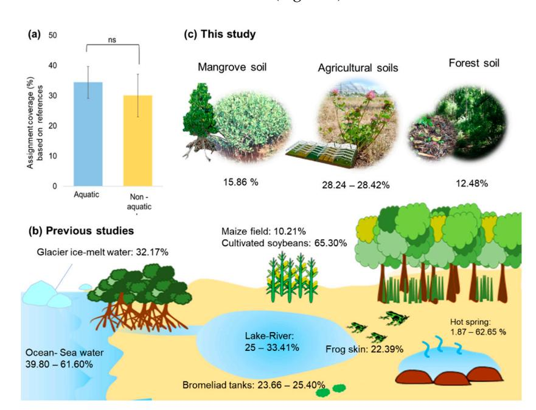
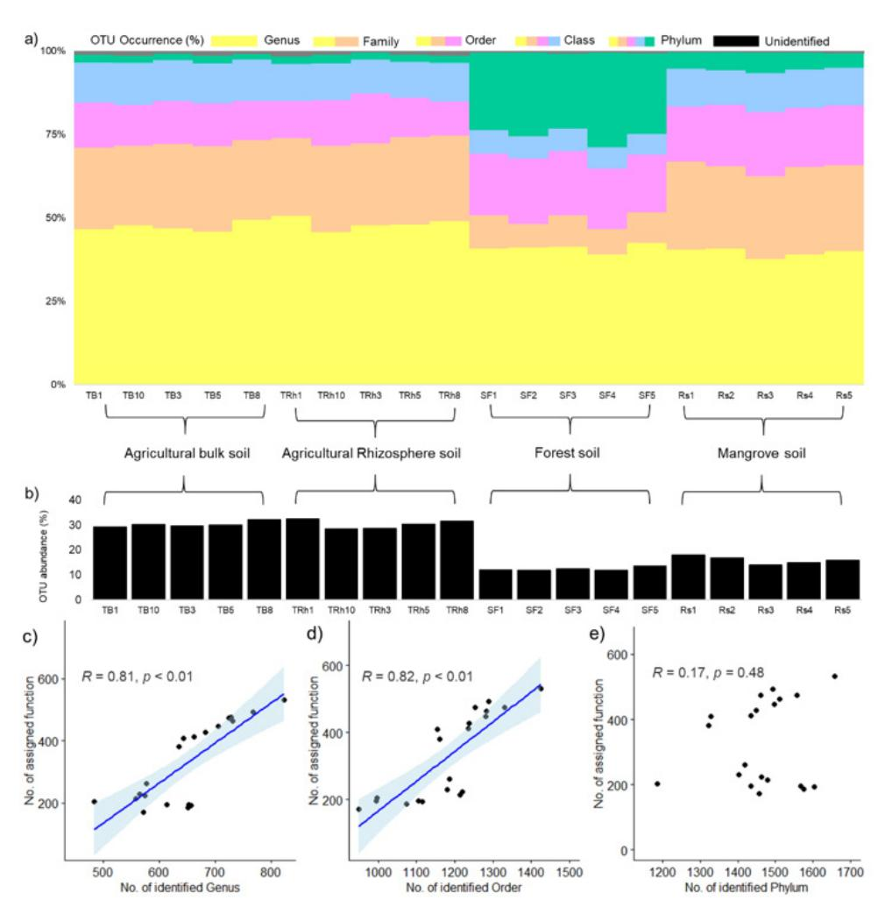
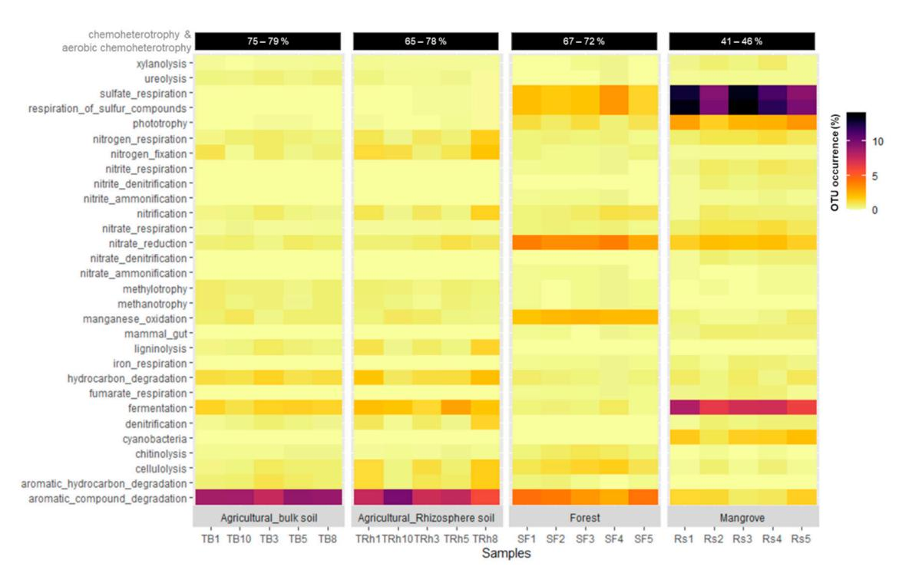
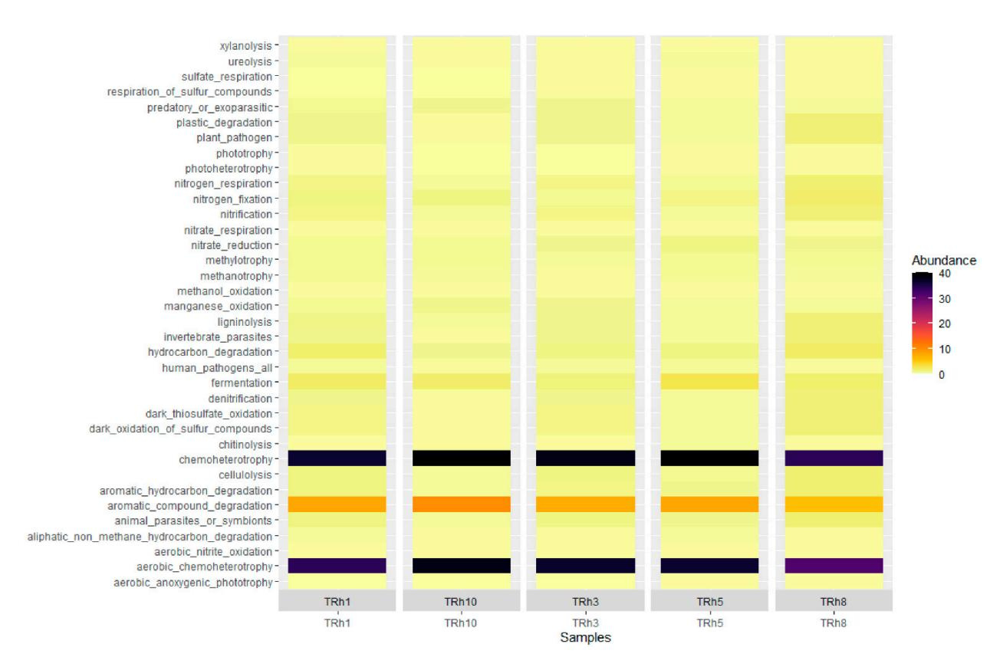
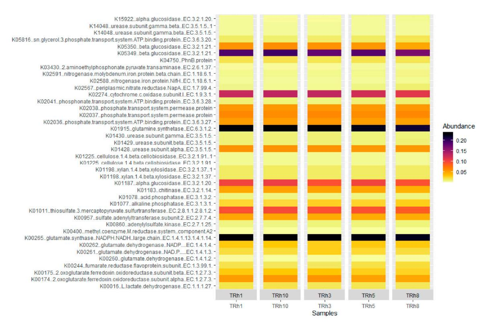

# Can We Use Functional Annotation of Prokaryotic Taxa (FAPROTAX) to Assign the Ecological Functions of Soil Bacteria?

Chakriya Sansupa, Sara Fareed Mohamed Wahdan, Shakhawat Hossen, Terd Disayathanoowat, Tesfaye Wubet and Witoon Purahong

## Special Issue

[Hide and Seek of Soil Microbes—Who Is Where with Whom and Why?](https://www.mdpi.com/journal/applsci/special_issues/soil_microbes)

#### Edited by

Dr. Maraike Probst and Dr. Judith Ascher-Jenull

# Article

#### *Article*

# **Can We Use Functional Annotation of Prokaryotic Taxa (FAPROTAX) to Assign the Ecological Functions of Soil Bacteria?**

**Chakriya Sansupa 1,2,†, Sara Fareed Mohamed Wahdan 2,3,† [,](https://orcid.org/0000-0002-0091-9717) Shakhawat Hossen 2,4,† [,](https://orcid.org/0000-0001-6370-7976) Terd Disayathanoowat 1,5,6,\*, Tesfaye Wubet 7,8,[‡](https://orcid.org/0000-0001-8572-4486) and Witoon Purahong 2,\* ,[‡](https://orcid.org/0000-0002-4113-6428)**

**Citation:** Sansupa, C.; Wahdan, S.F.M.; Hossen, S.; Disayathanoowat, T.; Wubet, T.; Purahong, W. Can We Use Functional Annotation of Prokaryotic Taxa (FAPROTAX) to Assign the Ecological Functions of Soil Bacteria?. *Appl. Sci.* **2021**, *11*, 688. [https://doi.org/10.3390/](https://doi.org/10.3390/app11020688) [app11020688](https://doi.org/10.3390/app11020688)

Received: 26 November 2020

Accepted: 5 January 2021

Published: 12 January 2021

**Publisher's Note:** MDPI stays neutral with regard to jurisdictional claims in published maps and institutional affiliations.

**Copyright:** © 2021 by the authors. Licensee MDPI, Basel, Switzerland. This article is an open access article distributed under the terms and conditions of the Creative Commons Attribution (CC BY) license [\(https://](https://creativecommons.org/licenses/by/4.0/) [creativecommons.org/licenses/by/](https://creativecommons.org/licenses/by/4.0/) [4.0/\)](https://creativecommons.org/licenses/by/4.0/).

1 Department of Biology, Faculty of Science, Chiang Mai University, Chiang Mai 50200, Thailand; chakriya\_s@cmu.ac.th 2 Department of Soil Ecology, UFZ-Helmholtz Centre for Environmental Research, 06120 Halle (Saale), Germany; sara-fareed-mohamed.wahdan@ufz.de (S.F.M.W.); shakhawat.hossen@ufz.de (S.H.) 3 Department of Botany, Faculty of Science, Suez Canal University, Ismailia 41522, Egypt 4 Institute of Ecology and Evolution, Friedrich-Schiller-Universität Jena, 07743 Jena, Germany 5 Research Center in Bioresources for Agriculture, Industry and Medicine, Chiang Mai University, Chiang Mai 50200, Thailand 6 Research Center of Microbial Diversity and Sustainable Utilization, Chiang Mai University, Chiang Mai 50200, Thailand 7 Department of Community Ecology, UFZ-Helmholtz Centre for Environmental Research, 06120 Halle (Saale), Germany; tesfaye.wubet@ufz.de 8 German Centre for Integrative Biodiversity Research (iDiv), Halle-Jena-Leipzig, 04103 Leipzig, Germany **\*** Correspondence: terd.dis@cmu.ac.th (T.D.); witoon.purahong@ufz.de (W.P.) † These authors contributed equally to this work. ‡ These authors are joint senior authors.

**Abstract:** FAPROTAX is a promising tool for predicting ecological relevant functions of bacterial and archaeal taxa derived from 16S rRNA amplicon sequencing. The database was initially developed to predict the function of marine species using standard microbiological references. This study, however, has attempted to access the application of FAPROTAX in soil environments. We hypothesized that FAPROTAX was compatible with terrestrial ecosystems. The potential use of FAPROTAX to assign ecological functions of soil bacteria was investigated using meta-analysis and our newly designed experiments. Soil samples from two major terrestrial ecosystems, including agricultural land and forest, were collected. Bacterial taxonomy was analyzed using Illumina sequencing of the 16S rRNA gene and ecological functions of the soil bacteria were assigned by FAPROTAX. The presence of all functionally assigned OTUs (Operation Taxonomic Units) in soil were manually checked using peer-reviewed articles as well as standard microbiology books. Overall, we showed that sample source was not a predominant factor that limited the application of FAPROTAX, but poor taxonomic identification was. The proportion of assigned taxa between aquatic and non-aquatic ecosystems was not significantly different (*p* > 0.05). There were strong and significant correlations (σ = 0.90–0.95, *p* < 0.01) between the number of OTUs assigned to genus or order level and the number of functionally assigned OTUs. After manual verification, we found that more than 97% of the FAPROTAX assigned OTUs have previously been detected and potentially performed functions in agricultural and forest soils. We further provided information regarding taxa capable of N-fixation, P and K solubilization, which are three main important elements in soil systems and can be integrated with FAPROTAX to increase the proportion of functionally assigned OTUs. Consequently, we concluded that FAPROTAX can be used for a fast-functional screening or grouping of 16S derived bacterial data from terrestrial ecosystems and its performance could be enhanced through improving the taxonomic and functional reference databases.

**Keywords:** soil; FAPROTAX; functional annotation; bacterial function

#### **1. Introduction**

Microbes are known as engines of an ecosystem as their growth and metabolisms drive various biogeochemical cycles and mediate many ecological processes such as decomposing organic compounds, solubilizing mineral substances and promoting plant performance [\[1\]](#page-14-0). Moreover, microbes also play important roles in removing toxic pollutants and chemical contaminants. For instance, microorganisms transform aromatic compounds into harmless metabolites or less/nontoxic forms [\[2\]](#page-14-1). Other harmful metabolites that are converted by microorganisms include hydrocarbon compounds [\[3\]](#page-14-2), heavy metals [\[4\]](#page-14-3) and other chemicals with excessive concentrations in an environment [\[5–](#page-14-4)[7\]](#page-14-5).

Various tools have been developed for the prediction of ecological functions of microbial taxa derived from amplicon-based next-generation sequencing data. These tools allow us to investigate both community and functional composition of microbes. The usefulness of these tools depends on thorough and global data on microbial community and functions, which would provide deeper insight for microbial ecological research and could be a lowcost alternative to metagenomic sequencing [\[8,](#page-15-0)[9\]](#page-15-1). As a result, many functional prediction tools were generated for both prokaryotic and eukaryotic microorganisms. For example, FUNGuild is a typical functional prediction tool for fungi, providing guild characteristics of the detected taxa, such as saprotroph, pathogen, decomposer or lichenivorous fungi, based on their taxonomic identity [\[10\]](#page-15-2). Other tools such as phylogenetic investigation of communities by reconstruction of unobserved states (PICRUSt) [\[11](#page-15-3)[,12\]](#page-15-4), pathway prediction by phylogenetic placement (PAPRICA) [\[13\]](#page-15-5), predicting functional profiles from metagenomic 16S rRNA data (Tax4Fun) [\[8\]](#page-15-0) and functional annotation of prokaryotic taxa (FAPROTAX) [\[9\]](#page-15-1) were developed to predict bacterial and archaeal functions. The former three predict the functions based on gene content of detected taxa, whereas the latter is the only tool that uses experimental data on culturable taxa to identify functional groups, metabolic phenotypes or ecologically relevant functions [\[9\]](#page-15-1). Furthermore, FAPROTAX may be more preferable for functional prediction of the biogeochemical cycle of environmental samples [\[9](#page-15-1)[,14](#page-15-6)[,15\]](#page-15-7).

The FAPROTAX is a database that maps bacterial or archaeal taxa to metabolic or ecologically relevant functions (i.e., nitrogen fixation, sulfate respiration or hydrocarbon degradation) using literature on culture representatives. This means that if all cultured members of a taxon can perform a function, the function will be assigned to all members of this taxon (cultured and uncultured). The FAPROTAX provides a python script to convert OTUs tables into functional tables based on taxa identified in a sample and functional phenotype of each taxon in the FAPROTAX database. This database was initially built for a study on marine environments, containing over 80 functions and 4600 taxonomic details of bacteria and archaea from oceans [\[9\]](#page-15-1). However, FAPROTAX used standard references (in Bergey's manual of systematic bacteriology [\[16–](#page-15-8)[20\]](#page-15-9). The prokaryotes [\[21\]](#page-15-10) and International Journal of Systematic and Evolutionary Microbiology [\[22\]](#page-15-11)) for general bacteria and archaea living in both aquatic and terrestrial ecosystems. This implies that the functional assignments are not completely dependent on habitats (aquatic vs. terrestrial systems) and highly dependent on taxonomic information at genus, species or strain levels of a particular bacterial and archaeal taxon. Consequently, many studies have used FAPROTAX for functional annotation of bacteria and archaea on various ecosystems including aquatic [\[9,](#page-15-1)[23–](#page-15-12)[27\]](#page-15-13) and terrestrial systems [\[28](#page-15-14)[–31\]](#page-15-15), as well as human and animal microbiome [\[14](#page-15-6)[,32\]](#page-15-16).

Despite the compatibility to the soil system, FAPROTAX is still not widely utilized for functional annotation of soil bacteria and archaea because there has been no effort to test the capability of FAPROTAX in soil. Some important questions remain, for example, (i) what proportions of bacterial and archaeal taxa are living in soil that are successfully annotated using FAPROTAX (as compared to aquatic systems) and (ii) are functional annotations using FAPROTAX accurate in soil systems?

This study aimed to investigate the potential use of FAPROTAX for bacterial functional annotation in non-aquatic ecosystems, specifically in soil. We used both published and newly prepared soil microbial datasets of three ecosystems (mangrove, agriculture and forest). In total, four datasets, including mangrove rhizosphere soil, agricultural bulk soil, agricultural rhizosphere soil and forest soil, were processed. We (i) tested the differences in functional annotated capacity between non-aquatic and aquatic ecosystem using published articles (meta-analysis), (ii) tested the accuracy of FAPROTAX annotation in soil systems by manually checking both appearance and functional performance in soils of all functionally assigned bacterial and archaeal operational taxonomic units (OTUs) with previously published literature and, (iii) tested additional options to improve the functional assignment capacity of FAPROTAX in soils by using relevant references (case study: nitrogen-fixing bacteria in bulk and rhizosphere soils of *Trifolium pratense*).

#### **2. Materials and Methods**

## *2.1. Sample Collection*

We set up experiments to evaluate the suitability of FAPROTAX to assign functions of soil bacterial and archaeal OTUs. Soil samples from two major terrestrial ecosystems, agricultural grassland and forest were collected. Furthermore, one published dataset on rhizosphere soil of *Rhizophora stylosa* was also added in this study [\[33\]](#page-16-0). Mangrove ecosystems are considered as the interface between aquatic and terrestrial ecosystems [\[34\]](#page-16-1); thus, the mangrove soil samples were used as the borderline between the aquatic and terrestrial ecosystems.

In the agricultural grassland ecosystem, bulk soil and rhizosphere soil of *Trifolium pratense* were taken from five experimental plots of extensively used meadow (ambient treatment) at the Global Change Experimental Facility (GCEF), Germany (51◦22′60′′ N, 11◦50′60′′ E) [\[35](#page-16-2)[,36\]](#page-16-3). These experimental plots are managed as described in Schädler et al. [\[35\]](#page-16-2), where grasses and legumes growing in the plot are used to feed livestock. In this study, three healthy *pratense* plants, which represent three subsamples, were taken from each experimental plot. Bulk soil and rhizosphere soil were collected following the protocol as described by Barillot et al. [\[37\]](#page-16-4). Briefly, bulk soil attached to the root was first removed by vigorous shaking, then rhizosphere soil was collected by shaking the root in PCR-grade water. Three subsamples of bulk soil and rhizosphere soil collected from the same plot were pooled into one composite sample for each soil fraction. Overall, five composite samples of bulk soil and five composite samples of rhizosphere soil (representing five true replicates) were obtained.

In the forest ecosystem, soil samples were taken from a bamboo-deciduous forest [\[38\]](#page-16-5) which was dominated by *Dendrocalamus membranaceous* and *Bambusa bambos*, in northern Thailand (18◦32′23′′ N, 99◦34′47′′ E). In detail, five replicated plots (5 × 5 m2 ) > 20 m apart were selected. Five soil subsamples were collected to 10 cm depth in each plot using an auger with 10 cm in diameter. The subsamples were then pooled into one composite sample. In this study, all composite soil samples were homogenized and sieved (2 mm) to remove stones, roots, macrofauna, and litter.

For the mangrove ecosystem, we used the dataset that has previously been published by Purahong et al. [\[33\]](#page-16-0). In detail, this dataset consisted of 5 replicated samples of rhizosphere soil of *R. stylosa* located in wetland at Pingtung County, southern Taiwan (22◦26′17.6′′ N, 120◦29′29.6′′ E). Sample collection was described in detail in Purahong et al. [\[33\]](#page-16-0). Briefly, five healthy, mature *stylosa* trees were selected, then four subsamples of rhizosphere soil around each selected tree were collected, pooled and sieved to make a composite sample.

All soil samples, including those from agricultural grassland, deciduous forest and mangrove ecosystems, were kept at −20 ◦C for further analyses.

## *2.2. DNA Extraction, Sequencing and Taxonomy and Functional Assignment*

DNA samples of both agricultural soils were extracted by QIAGEN DNeasy Power-Soil kit, whereas those of forest soil were extracted by NucleoSpin® Soil DNA extraction kit. PCR amplification of the bacterial V3-V4 regions was conducted using the

bacterial primer pair Bact341F (5′ -CCTACGGGNGG-CWGCAG-3′ ) and Bact785R (5′ - GACTACHVGGGTATCTAATCC-3′ ) [\[39\]](#page-16-6). Amplicons were sequenced using an Illumina MiSeq platform and V3 Chemistry (Illumina). All amplification and sequencing steps were performed at RTL Genomics (Lubbock, TX, USA).

Bioinformatics was proceeded on MOTHUR 1.33.3 [\[40\]](#page-16-7) following *Standard Operating Procedure* (SOP) custom analysis workflow. Raw reads, overlapping more than 20 base pairs, were first assembled to generate paired-end reads, then filtered to get high-quality reads, containing at least 200 bp length and having a minimum average quality of 25 Phred score. Chimeric sequences were checked using UCHIME in de novo mode [\[41\]](#page-16-8), as implemented in MOTHUR and removed from the datasets. The cleaned sequences were clustered at 97% sequence identity and assigned taxonomy using the SILVA 132 database for bacterial 16S rRNA gene [\[42\]](#page-16-9). Ecologically relevant functions were then assigned to all detected OTUs using FAPROTAX [\[9\]](#page-15-1). In detail, a taxon (e.g., strain, species or genus) was annotated to certain functions if there was a literature report on a culture representative of the taxon that performed the functions. For example, if all cultured species of a genus were previously reported as sulfate reducers, all detected taxa belonging to the genus were also considered as sulfate reducers. All database and assignment instructions are available at [http://www.loucalab.com/archive/FAPROTAX/.](http://www.loucalab.com/archive/FAPROTAX/) Lastly, rare OTUs (singletons to tripletons), which could potentially originate from sequencing error, were removed. The remaining reads were normalized to the minimum read count per sample of each dataset. Final OTU tables of all datasets are available in supplementary Tables S1.1–S1.3. The raw sequences are available in the National Center for Biotechnology Information (NCBI) under BioProject accession number: PRJNA646011 for forest and agricultural soils and PRJNA554586 for mangrove soil.

#### *2.3. Validation of FAPROTAX*

#### 2.3.1. Peer-Reviewed Publications: Difference in Functional Assignment Percentage of Aquatic and Non-Aquatic Samples.

The functional assignment percentage (proportion of number of OTUs assigned by FAPROTAX to total detected OTUs in each study) presented in peer-reviewed publications was gathered and divided based on sampling source into 2 main groups, including aquatic and non-aquatic data (Table S3). Differences in the functional assignment percentage over aquatic and non-aquatic data were tested using the Mann-Whitney U test in PAST program v. 2.17c [\[43\]](#page-16-10). Shapiro-Wilk and Fligner-Killeen were used to test normality and equality of variances between the two groups.

## 2.3.2. Taxonomic Identification and FAPROTAX Assignment

The datasets, including twenty soil samples derived from agricultural-bulk soil (*n* = 5), agricultural-rhizosphere soil (*n* = 5), forest soil (*n* = 5) and mangrove soil (*n* = 5), were used to test the correlation between number of functionally assigned OTUs and number of OTUs identified to different taxonomic ranks (Genus, Order and Phylum). Firstly, the normality of these data sets was analyzed using Shapiro-Wilk test. We detected non-normal distribution in some data sets (*p* < 0.05); thus, Spearman's rank correlation method was used to test the correlation between number of functionally assigned OTUs and number of OTUs identified to each taxonomic rank. The correlation method was analyzed using stat\_cor function in ggpubr package [\[44\]](#page-16-11). The simple linear regressions, showing the relationship between the two variables, were plotted with *ggscatter* function of the *ggpubr* package. These correlation analyses were run on R (version 3.6.2) [\[45\]](#page-16-12).

## 2.3.3. Validation of FAPROTAX on Soil Bacteria

Bacterial taxa provided in a file called "FAPROTAX.txt", which is a database for FAPROTAX analysis [\(http://www.loucalab.com/archive/FAPROTAX/lib/php/index.](http://www.loucalab.com/archive/FAPROTAX/lib/php/index.php?section=Download) [php?section=Download\)](http://www.loucalab.com/archive/FAPROTAX/lib/php/index.php?section=Download), were randomly selected and habitat of the selected taxa was identified using references cited in the database. This action indicated that prokaryotic

taxa and functional results in the FAPROTAX database have been obtained not only from aquatic samples but also from non-aquatic environments (an example is presented in Table S4) which lead to the promising application of FAPROTAX in soil samples.

Subsequently, four datasets, including agricultural-bulk soil, agricultural-rhizosphere soil, forest soil and mangrove soil, were used as examples to validate the suitability of FAPROTAX applied to soil samples. In this section, OTUs that were functionally assigned by FAPROTAX were used (Tables S2.1–S2.3). In detail, FAPROTAX assigned OTUs was first checked on the appearance of each taxon in soil habitat using peer-reviewed publications. If a taxon was previously reported in soil systems, we confirmed the appearance by using the word "Yes". On the other hand, if there was no record of a taxon in soil systems, we used the word "No" (Tables S2.1–S2.3: column named "*Confirmation living in soil*"). Secondly, functional performance in soil systems of the FAPROTAX assigned OTUs was manually checked using a similar procedure as FAPROTAX database (a taxon was assigned to certain functions if there was a literature report on a representative of the taxon that performed the functions). The functional performance was confirmed by using "Yes" when particular OTUs have been reported and performed the function in soil, whereas "No" was used for those with no record of functional performance in soil (Tables S2.1–S2.3: column named "*Confirmation on functions in soil habitat*"). The performance of FAPROTAX assignment in soil sample was indicated by number of FAPROTAX assigned OTUs that were both available and performed the assigned function in soil.

## 2.3.4. Additional Literature on Soil Functions

Bacterial taxa that were identified as a driver on phosphate solubilization, potassium solubilization and nitrogen fixation were provided (Table [1\)](#page-6-0). These taxa and functions were overlooked from FAPROTAX database (file named "FAPROTAX.txt" available at FAPROTAX webpage). Subsequently, the advantage of the literature added was tested using soil samples from agricultural bulk soil and rhizosphere soil of *T. pratense* datasets. In detail, the nitrogen fixation function was manually assigned to a particular OTU in the datasets when that OTU was identified as one of the taxa in Table [1](#page-6-0) (nitrogen fixation). Then, the number of manually assigned OTUs was counted and compared with that of OTUs assigned to nitrogen fixation by FAPROTAX.

**Table 1.** A list of bacterial taxa capable of nitrogen fixation, phosphate and potassium solubilization.

| Functions         |                | Taxa          |                    | References    |
|-------------------|----------------|---------------|--------------------|---------------|
| Nitrogen fixation |                |               |                    |               |
| Allorhizobium,    | Azorhizobium,  |               | Bradyrhizobium,    | Ensifer,      |
| Mesorhizobium,    | Rhizobium,     |               | Aminobacter,       | Devosia,      |
| Methylobacterium, |                | Microvirga,   | Ochrobactrum,      |               |
| Phyllobacterium,  |                | Shinella,     | Burkholderia,      |               |
| Paraburkholderia, | Cupriavidus,   |               | Bacillus safencis, | Bacillus      |
| licheniformis,    | Bacillus       | cereus,       | Bacillus           | megaterium,   |
| Bacillus          | aerophilus,    | Bacillus      | flexus,            | Bacillus      |
| oceanisediminis,  | Bacillus       | circulans,    | Bacillus           | aerophilus,   |
|                   | Bacillus       | subtilis      |                    |               |
|                   |                |               |                    | [46 ,47]      |
| Bacillus          | mucilaginosus, | Bacillus      | circulanscan,      | Bacillus      |
| edaphicus,        | Bacillus       | megaterium,   | Acidithiobacillus  |               |
| ferrooxidans,     | Enterobacter   | hormaechei,   |                    | Paenibacillus |
| mucilaginosus,    |                | Paenibacillus | glucanolyticus     |               |
|                   |                |               |                    | [48 ,49]      |

**Table 1.** *Cont.*

| Functions           |                     | Taxa                | References          |
|---------------------|---------------------|---------------------|---------------------|
| Aerobactor          | aerogenes,          | Actinomadura        | oligospora,         |
| Azospirillum        | brasilense,         | Bacillus            | circulans, Bacillus |
| cereus, Bacillus    | fusiformis,         | Bacillus            | pumils, Bacillus    |
| megaterium,         | Bacillus            | mycoides, Bacillus  | polymyxa,           |
| Bacillus            | coagulans, Bacillus | chitinolyticus,     | Bacillus            |
| subtilis,           | Pseudomonas         | putida, Pseudomonas | striata,            |
| Pseudomonas         | fluorescens,        | Pseudomonas         | calcis,             |
| Escherichia         | intermedia,         | Enterobacter        | asburiae, Serratia  |
| phosphoticum,       | Thiobacillus        | ferroxidans,        | Thiobacillus        |
| thioxidans,         | Rhizobium           | meliloti, Bacillus  | pulvifaciens,       |
| Bacillus            | sircalmous,         | Pseudomonas         | canescens,          |
| Pseudomonas         | fluorescens,        | Pantoea             | agglomerans,        |
| Rhizobium           | meliloti,           | Rhizobium           | leguminosarum,      |
| Mesorhizobium       | mediterraneum,      |                     | Acinetobacter       |
| rhizosphaerae,      | Streptomyces        | albus, Streptomyces | cyaneus,            |
| Streptoverticillium | album,              | Azotobacter         | chroococcum         |
|                     |                     |                     | [50 ,51]            |

#### **3. Results**

## *3.1. Assignment Percentage of Aquatic and Non-Aquatic Samples Based on Previous Studies*

We found no significant difference between assignment percentage (proportion of FAPROTAX assigned OTUs in total detected OTUs) of aquatic and non-aquatic data in datasets from peer-reviewed publications (Figure [1](#page-6-1) and Table S3). The percentage of aquatic samples, including water from hot spring, lake, river, ocean and glacier, varied from 1.87% to 62.65%, while those from other ecosystems, including various soil samples and animal skins, varied from 10.21% to 65.30% (Figure [1\)](#page-6-1).

**Figure 1.** FAPROTAX assignment percentages over aquatic and non-aquatic ecosystems. (**a**) Bar plot showing the average proportion of FAPROTAX assignment based on previous studies of aquatic samples (blue) and non-aquatic samples (yellow). Error bars represent standard error of the mean and the letter "ns" indicates statistical insignificance tested by Mann-Whitney U test. (**b**) FAPROTAX assignment percentage over different sample sources based on previous literature. (**c**) The assignment percentage found in soil samples from mangrove, agriculture and forest ecosystems in this present study.

#### *3.2. General Overview of Bioinformatics and FAPROTAX Assignment of Data Derived from Soil Samples*

A total of 196,366 reads (on average 19,637 ± 2355 reads per sample) of bacterial 16S rRNA gene were detected in agricultural bulk soil and rhizosphere soil, after quality filtering and chimeric sequence removal. For forest and mangrove soils, 119,433 reads (on average 23,886 ± 1980 reads per sample) and 66,263 reads (on average 19,637 ± 2355 reads per sample [\[33\]](#page-16-0)) were detected, respectively. After rare OTUs were removed, the sequences were normalized to the smallest read numbers per sample, which were 4951, 12,269 and 7086 [\[33\]](#page-16-0) reads per sample for agricultural soils (bulk soil and rhizosphere soil), forest soil, and mangrove rhizosphere soil, respectively.

Different bacterial OTUs were obtained from agricultural bulk soil (3329), agricultural rhizosphere soil (3365), forest soil (2177) and mangrove rhizosphere soil of *R. stylosa* (2497). The proportion of OTUs that were identified to different taxonomic ranks and that of functional assignments were presented in Figure [2.](#page-7-0) Functional assignment capacities of agricultural soils (bulk soil and rhizosphere soil), forest soil and mangrove rhizosphere soil accounted for 28.24–28.42%, 12.48% and 15.86% (Figure [1\)](#page-6-1) and the number of functions assigned to those samples were 34, 36, 37 and 52 functions, respectively (Figure S1). Predominant functions across all samples belonged to chemoheterotrophy, followed by aerobic chemoheterotrophy (Figure [3\)](#page-8-0). However, when we focused on more specific functions, the result showed differences in dominant functions involved in biogeochemical cycling derived from each ecosystem (Figure [3\)](#page-8-0).

**Figure 2.** Taxonomic information across all soil samples and correlation between numbers of identified and functionally assigned OTUs. (**a**) Proportion of OTUs identifying to different taxonomic ranks. (**b**) Bar plot showing FAPROTAX's func-

tional assignment percentage (TB: agricultural bulk soil, TRh: agricultural rhizosphere soil, SF: forest soil and Rs: mangroverhizosphere soil). Linear regression showing Spearman's rank correlation coefficient and *p*-value on the relationship between number of FAPROTAX-functional assigned OTUs and number of identified OTUs to different taxonomic ranks which are (**c**) Genus, (**d**) Order and (**e**) Phylum. "No." is an abbreviation of "Number".

σ σ Significant and positive correlations (σ = 0.90–0.95, *p* < 0.01, Figure [2c](#page-7-0),d) were found between the number of functionally assigned OTUs and number of OTUs assigned at genus and order levels, whereas the correlation between that at phylum level was not statistically significant (σ = 0.11, *p* = 0.64, Figure [2e](#page-7-0)). Although strong correlations between the numbers of functionally assigned OTUs and numbers of OTUs assigned at genus and order levels are detected in this study, we noted that a small set of data (20 samples) was used for the correlation analysis. Thus, these correlation results should be interpreted carefully.

**Figure 3.** Heatmap of metabolic phenotypes/functions of bacteria. The data based on OTUs occurrence (number of OTUs capable for each function) derived from agricultural bulk soil (TB), agricultural rhizosphere soil (TRh), forest soil (SF) and mangrove-rhizosphere soil (Rs) samples.

#### *3.3. Correlation between the Number of Functionally Assigned OTUs and Taxonomically Identified OTUs in Each Taxonomic Rank*

#### *3.4. Accuracy of Functionally Assigned Bacterial and Archaeal OTUs Based on FAPROTAX in Soil Systems*

The result showed that more than 97% of the FAPROTAX assigned OTUs have previously been detected and potentially performed the functions in agricultural (1081 out of 1098 OTUs) and forest soils (265 out of 272 OTUs). On the other hand, only 28.79% (114 out of 396 OTUS) of functionally assigned OTUs detected in Mangrove rhizosphere soil had record of appearance and assigned functional performance in soil. We found that several detected taxa, including but not limited to *Demequina*, *Euzebya*, *Maribacter*, *Marinobacter*, *Muricauda*, *Desulfatitalea*, *Desulfopila*, were found to potentially perform the assigned functions in an estuary, seawater, sediment, and other marine habitats (Table S2.3). However, it should be noted that mangrove is a unique habitat with a mixture of land and sea, and therefore some aquatic bacteria can possibly be detected.

## *3.5. Impact of Adding Reported Datasets to Functional Assignment Percentage*

In total, 17 and 31 OTUs detected in the agricultural bulk and rhizosphere soil, respectively, were functionally assigned to nitrogen fixation by FAPROTAX, while the additions of 53 and 59 OTUs were assigned the function by a manual search based on reference given in Table [1.](#page-6-0) Several taxa that could potentially perform nitrogen fixation were assigned in addition to *Rhizobium gallicum*, the only taxon that was assigned by FAPROTAX (Table [2\)](#page-9-0).

**Table 2.** Number of OTUs capable of N-fixation before and after adding data from previous studies and the names of additional taxa.

| No. of N-Fixation      |                                             |                                                |
|------------------------|---------------------------------------------|------------------------------------------------|
| No. of Additional OTU  |                                             |                                                |
| Assigned to N-Fixation |                                             |                                                |
|                        |                                             | Additional Taxa Capable of N-Fixation          |
| Bulk soil 17 53        |                                             |                                                |
|                        |                                             | Bacillus megaterium, Bacillus cereus, Ensifer, |
|                        | Bradyrhizobium,                             | Microvirga, Phyllobacterium,                   |
|                        | Mesorhizobium,                              | Allorhizobium-Neorhizobium                    |
|                        | Burkholderia-Caballeronia-Paraburkholderia, | Devosia,                                       |
| Rhizosphere soil 31 59 |                                             |                                                |
|                        | Bacillus                                    | megaterium, Ensifer, Bradyrhizobium,           |
|                        |                                             | Mesorhizobium, Phyllobacterium, Microvirga,    |
|                        |                                             | Devosia, Allorhizobium-Neorhizobium           |

## **4. Discussion**

Keeping possible biases inherent to molecular technique and next-generation sequencing (NGS) in mind [\[9\]](#page-15-1) (i.e., PCR, short-read sequences, pan-genome concept of bacterial evolution), many works demonstrated that NGS can be successfully used to improve our understanding of bacterial taxonomic structure and functional profile across aquatic [\[9,](#page-15-1)[17](#page-15-17)[–21\]](#page-15-10) and terrestrial ecosystems [\[22–](#page-15-11)[25\]](#page-15-18). One of the most commonly used NGS techniques (Illumina Miseq) offers paired-end reads, which increase almost two times of the non-merging read length (i.e., 580 bp for MiSeq reads of 300 bp with a 20 bp minimal overlap) [\[52\]](#page-16-19). In this study, we demonstrated that FAPROTAX was able to assign functions to prokaryotic taxa derived from both aquatic and terrestrial sources, especially soils. Even though aquatic samples tend to gain higher assignment than those of terrestrial samples, no significant difference was found on assignment percentage between different sample sources based on a limited number of publications (Table S3).

Several previous studies used this tool to predict the functions of bacterial/archaeal communities residing in not only aquatic habitats but also in soil samples. For example, FAPROTAX was used to assess the impact of microbial inoculation and fertilizer application on soil bacterial functions involved in for C and N cycles [\[53](#page-16-20)[–55\]](#page-16-21). Specifically, Gao et al. [\[53\]](#page-16-20) showed stimulation of denitrification and nitrification in soil after *Spartina alterniflora* invasion, as well as Li et al. [\[54\]](#page-16-22) revealed a significant effect of straw incorporation and nitrogen fertilization on hydrocarbon degradation and nitrogen fixation. Similarly, Wang et al. [\[55\]](#page-16-21) showed an increase of aerobic nitrite oxidation in soil inoculated with multi-species inoculants. Moreover, FAPROTAX was utilized in several studies that aimed to compare the effect between different treatments or a response of site managements [\[15,](#page-15-7)[28,](#page-15-14)[56](#page-16-23)[–59\]](#page-17-0). For instance, it was used to investigate the effects of bacterial functions after grazing prohibition and in plantation and natural forest [\[15](#page-15-7)[,28](#page-15-14)[,56\]](#page-16-23). The increase in denitrification and nitrification functions was found after soil tillage and forest-to-agriculture conversion [\[57,](#page-16-24)[58\]](#page-16-25). In addition to soil samples, FAPROTAX has also been helpful in predicting bacterial functions of animals and human microbiome. For examples, FAPROTAX was used to compare the functional richness of bacteria in gallbladder and gut between young and adult rabbits [\[60\]](#page-17-1),

infer biogeochemical processes, especially in nitrogen and manganese cycling occurring on human and mammalian skin [\[32\]](#page-15-16) and show the impact of environmental factors on the functional diversity of bacteria in frog skin [\[14\]](#page-15-6). Although FAPROTAX is unable to reveal functional phenotypes of all taxa in the community, previous studies have shown that it was a helpful tool to highlight functions related to biogeochemical dynamics, especially on N and C cycle in non-aquatic samples and to compare functional profiles among treatments.

Our results also showed that sample source was not a primary factor that limited the application of FAPROTAX, especially in soil samples. A strong positive and significant correlation between the number of functional assigned OTUs and the number of OTUs identified to the order and genus levels, but not with those assigned to phylum level implies that poor taxonomic identification was an important factor that limited FAPROTAX functional assignment in soil samples. Since certain functions are conserved at low taxonomic levels (species, genus or order), OTUs identified only at a phylum level usually cannot be assigned to any function. The study cases on agricultural and forest soil samples reported that more than 97% of functionally assigned OTUs have previously been reported to exist (previously reported on both appearance and functional performance) in soil samples (Tables S2.1–S2.3). We found several studies that confirmed the presence of functionally assigned taxa in soil bacterial communities. For example, taxa related to C-cycle such as *Nocardioides,* which was previously isolated from soil, was assigned to aromatic compound degradation and confirmed the ability to degrade hexachlorobenzene [\[61\]](#page-17-2). *Rhodococcus* species was also assigned to hydrocarbons degradation and was found to have the ability to utilize various hydrocarbons groups in soil [\[62\]](#page-17-3). Similarly, taxa involved in nitrogen cycles, such as *Rhizobium gallicum* (nitrogen fixation) and *Micromonospora aurantiaca* (nitrate reduction and cellulolysis), were also found in soil [\[63](#page-17-4)[,64\]](#page-17-5) (see Tables S2.1–S2.3 for more information). These lines of evidence confirmed that some taxa available in the FAPROTAX database are generally dispersed across different ecosystems, including soil, even though they were originally generated from aquatic samples. Moreover, we showed that bacterial taxa and functional prediction presented in the FAPROTAX database were not only derived from aquatic samples but also from soil, plants and animals (Table S4). These results support our hypothesis that FAPROTAX was compatible with terrestrial ecosystems. On the other hand, lower portion of soil-detected taxa but high portion of marine-detected taxa in mangrove rhizosphere soil was not surprising results because mangrove land is located at the boundary between terrestrial and aquatic ecosystems. Therefore, it is possible to detect both marine and soil bacterial taxa in the area [\[65\]](#page-17-6). More importantly, we confirmed that a number of bacterial taxa found in mangrove rhizosphere soil were also found in soil system.

Furthermore, we demonstrated that the addition of references on bacterial taxa capable of a particular function could significantly increase the efficiency of the functional assignment. This study showed that adding more references to nitrogen fixation function can increase the number of OTUs assigned to the function by 2–3 times, accounting for a 2% increase in total functional assignment percentage. The absence of the nitrogen fixation function may be due to FAPROTAX being created based on aquatic samples [\[9\]](#page-15-1); thus, some terrestrial specialized taxa were neglected from the database. Furthermore, bulk and rhizosphere soils of red clover (*Trifolium pratense*) are known to colonize by diverse N-fixing bacteria [\[66\]](#page-17-7). Consequently, using relevant and up-to-date references of current status of Nfixing bacterial legume symbiosis can strongly increase the number of functional assigned bacterial taxa. Specifically, many important N-fixing bacterial genera, for examples *Ensifer*, *Bradyrhizobium*, *Microvirga*, *Mesorhizobium*, *Devosia*, etc., are not included in FAPROTAX as N-fixing bacteria. Therefore, FAPROTAX database still needs to be extended to cover other relevant functions in soils. This study provided soil bacterial taxa capable of nitrogen fixation, phosphate and potassium solubilization, so further study on soil sample could make the most of our work.

Although this study has demonstrated that FAPROTAX was compatible with soil samples, the bias of this tool should be kept in mind. The FAPROTAX has an assumption that if

all cultured members of a taxon can perform a function, all members of that taxon (cultured and uncultured) can perform that function. Moreover, since soil ecosystem contains several biogeochemical cycles as well as diverse prokaryotic taxa, it is concerning that FAPROTAX may have low performance (low functional assignment percentage) for certain soil samples. We recommend that further work should add more soil-specific functions and prokaryotic taxa to optimize the performance of this tool. On the other hand, other alternative tools can be applied for bacterial functional annotation in soil, such as PICRUSt [\[11](#page-15-3)[,12\]](#page-15-4) or Tax4Fun [\[8\]](#page-15-0). Notice should be taken that each tool provides different aspects of bacterial functional phenotypes. FAPROTAX presents functional phenotypes as metabolic and ecologically relevant functions which are predicted based on the literature of cultured taxa (i.e., nitrogen fixation, nitrification, hydrocarbon degradation, chitinolysis, cellulolysis, etc.), whereas PICRUSt or Tax4Fun present functions as phenotypes of gene families or enzyme activities which are predicted based on gene content. We simulate results from Tax4Fun to show the functional phenotype of bacteria associated with the rhizosphere soil samples of *Trifolium pratense* used in this study (Appendix [A\)](#page-12-0). The simulated results show various potential enzymes that may be relevant to many soil functions (Figure [A2\)](#page-13-0). In our opinion, each functional annotation tool provides information on different aspects of bacterial functions. Selection of such tools for a particular study should depend on its purposes. If a study focuses on key bacterial functions important for biogeochemical cycling as well as microbemicrobe, plant-microbe and animal-microbe interactions, FAPROTAX can be a suitable choice. On the other hand, if a study targets at changes of gene expression or potential enzyme activity, other tools should be considered, such as PICRUSt or Tax4Fun.

In conclusion, this study presented that FAPROTAX database can be effectively used to predict function of bacteria in soil samples. Even though the database cannot predict function of all detected taxa, it can be beneficial for fast-functional screening or grouping of 16S derived bacterial data from any ecosystem. We further suggested that additional datasets of both the taxonomy and functional references could improve the FAPROTAX database and thereby increase the number of functionally assigned OTUs derived from 16S rRNA.

**Supplementary Materials:** The following are available online at [https://www.mdpi.com/2076-3](https://www.mdpi.com/2076-3417/11/2/688/s1) [417/11/2/688/s1;](https://www.mdpi.com/2076-3417/11/2/688/s1) Figure S1: Heatmap of all detected functions of bacteria across all soil samples. The data based on OTUs occurrence (number of OTUs capable for each function) derived from agricultural bulk soil (TB), agricultural rhizosphere soil (TRh), forest soil (SF) and mangrove-rhizosphere soil (Rs) samples. Table S1.1: OTU table of prokaryotic taxa detected in agricultural soil. Table S1.2: OTU table of prokaryotic taxa detected in forest soil. Table S1.3: OTU table of prokaryotic taxa detected in mangrove-rhizosphere soil. Table S2.1: FAPROTAX validation of prokaryotic taxa prokaryotic taxa detected in agricultural soils showing evident based on peer-reviewed literature of soil ecosystems on the appearance and the functional performance of prokaryotic taxa detected in agricultural soils. Table S2.2: FAPROTAX validation of prokaryotic taxa prokaryotic taxa detected in forest soil showing evident based on peer-reviewed literature of soil ecosystems on the appearance and the functional performance of prokaryotic taxa detected in forest soil. Table S2.3: FAPROTAX validation of prokaryotic taxa prokaryotic taxa detected in mangrove rhizosphere soil showing evident based on peer-reviewed literature of soil ecosystems on the appearance and the functional performance of prokaryotic taxa detected in mangrove rhizosphere soil. Table S3: Data from peer-reviewed publications showing sample sources and proportion of number of OTUs assigned by FAPROTAX to total detected OTUs. Table S4: Example of data from FAPROTAX database showing functions, prokaryotic taxa and their habitat obtained from the reference cited in FAPROTAX database.

**Author Contributions:** Conceptualization, T.D., T.W. and W.P.; field experiments, C.S., S.F.M.W., T.D. and W.P.; molecular analysis, C.S., S.F.M.W., S.H. and W.P.; bioinformatics, S.F.M.W. and T.W.; software, S.F.M.W. and T.W.; formal analysis, C.S., S.H. and W.P.; investigation, C.S., S.F.M.W., S.H. and W.P.; resources, T.D. and W.P.; data curation, C.S., S.H. and W.P.; writing—original draft preparation, C.S., W.P. and T.D.; writing—review and editing, C.S., S.F.M.W., S.H., T.D., T.W. and W.P.; visualization, C.S. and W.P.; supervision, W.P. and T.D.; funding acquisition, W.P. and T.D. All authors have read and agreed to the published version of the manuscript.

**Funding:** The next generation sequencing cost was covered by personal research budgets of W.P. from the Helmholtz Centre for Environmental Research—UFZ.

**Institutional Review Board Statement:** Not applicable.

**Informed Consent Statement:** Not applicable.

**Data Availability Statement:** Publicly available datasets were analyzed in this study. This data can be found under BioProject accession number: PRJNA646011 and PRJNA554586.

**Acknowledgments:** We appreciate the Helmholtz Association, the Federal Ministry of Education and Research, the State Ministry of Science and Economy of Saxony-Anhalt, and the State Ministry for Higher Education, Research and the Arts Saxony to fund the Global Change Experimental Facility (GCEF) project. We thank to Martin Schädler for his role in setting up and maintaining the GCEF project and the staffs of the Bad Lauchstädt Experimental Research Station for their work in maintaining the plots and infrastructures of the GCEF. Benjawan Tanunchai and Dolaya Sadubsarn are thanks for helping with field experiments and molecular works. We also thank to Forest Restoration Research Unit (FORRU-CMU) for their support on field experiment in Thailand. C.S. thanks to Science Achievement Scholarship of Thailand for financial support. S.F.M.W. is supported financially by the Egyptian Scholarship (Ministry of Higher Education, External Missions 2016/2017 call). T.D. is partially supported by Chiang Mai University.

**Conflicts of Interest:** The authors declare no conflict of interest.

#### **Appendix A. Functional Phenotypes Derived from Tax4Fun and FAPROTAX. A Simulate Result from Bacterial Communities of Agricultural Rhizosphere of** *Trifolium pretense*

A dataset (OTU table) consisted of bacterial communities in the rhizosphere of *Trifolium pratense* was selected to simulate the result derived from Tax4Fun. In detail, the Tax4Fun [\[8\]](#page-15-0) R package, which employs 16S rRNA gene-based taxonomic information, and the Kyoto Encyclopedia of Genes and Genomes (KEGG) database were used to predict the metabolic functional attributes of bacterial communities in the rhizosphere of *T. pratense*. Tax4Fun converted the SILVA-labelled OTUs into prokaryotic KEGG organisms and normalized these predictions using the 16S rRNA copy number (obtained from the National Center for Biotechnology Information genome annotations). Furthermore, FAPROTAX was also used to predicted bacterial function of the same dataset following the FAPROTAX's instruction [\(http://www.loucalab.com/archive/FAPROTAX/\)](http://www.loucalab.com/archive/FAPROTAX/) [\[9\]](#page-15-1).

A total of 36 functions were derived from FAPROTAX (Figure [A1\)](#page-13-1). FAPROTAX showed ecologically relevant functions which concern biogeological cycles, such as nitrification, cellulolysis and hydrocarbon degradation, and the interaction of microbe to plants/animals, such as plant pathogen or invertebrate parasites (Figure [A1\)](#page-13-1). On the other hand, Tax4Fun provided a total of 6338 functions which included functions that involved in soil biogeochemical cycles, such as chitinase, beta-glucosidase or acid phosphatase, and not involved in soil system, such as sn-glycerol 3-phosphate transport system ATP-binding protein, queuine tRNA-ribosyltransferase, and DNA-directed RNA polymerase. In order to use Tax4Fun, the researcher might have an overview of functions required for their work, then sort only interesting functions to be investigated. For example, in this case, we gathered 30 enzymes involved in soil system (Table [A1\)](#page-14-6) and show the functional profile presented in Figure [A2.](#page-13-0)

However, we believe that both functional annotation tool contributes most benefit, but different aspect for each work. The selection of these tools should depend on the purpose of each study. If a study focuses on the biogeochemical cycle or the interaction of microbe to plants/animals, FAPROTAX would be the best alternatives. Moreover, FAPRROTAX is quite easy to follow as it provides plain functional phenotypes. On the other hand, if a study pays more attention to enzyme activity, Tax4Fun should be a great choice.

**Figure A1.** Heatmap shows all functions of bacteria predicted by FAPROTAX. The data based on OTUs abundance derived from rhizosphere soil samples (TRh) of red clover (*Trifolium pratense*).

**Figure A2.** Heatmap shows functions of bacteria predicted by Tax4Fun. The data based on OTUs abundance derived from rhizosphere soil samples (TRh) of red clover (*Trifolium pratense*).

**Table A1.** Tax4Func functions involved in soil system and its description.

|               |                                | Tax4Fun                 | Output                        |                   | Function’s     | Description             | References |
|---------------|--------------------------------|-------------------------|-------------------------------|-------------------|----------------|-------------------------|------------|
| K02274;       | cytochrome                     | c oxidase               | subunit I [EC:1.9.3.1]        | Aerobic           | Respiration    |                         | [67]       |
| K00860;       | adenylylsulfate                | kinase                  | [EC:2.7.1.25]                 | Assimilatory      |                | Sulfate Reduction       | [67]       |
| K00957;       | sulfate                        | adenylyltransferase     | subunit 2 [EC:2.7.7.4]        | Assimilatory      |                | Sulfate Reduction       | [67]       |
| K00016;       | L-lactate                      | dehydrogenase           | [EC:1.1.1.27]                 | Fermentation      |                |                         | [67]       |
| K00400;       | methyl                         | coenzyme                | M reductase system, component | A2 Methanogenesis |                |                         | [67]       |
| K00265;       | glutamate                      | synthase                | (NADPH/NADH) large            | chain             |                |                         |            |
| [EC:1.4.1.13  | 1.4.1.14]                      |                         |                               | Nitrogen          | Assimilation   |                         | [67]       |
| K01915;       | glutamine                      | synthetase              | [EC:6.3.1.2]                  | Nitrogen          | Assimilation   |                         | [67]       |
| K02588;       | nitrogenase                    | iron protein            | NifH [EC:1.18.6.1]            | Nitrogen          | Fixation       |                         | [67]       |
| K02591;       | nitrogenase                    | molybdenum-iron         | protein beta chain            |                   |                |                         |            |
| [EC:1.18.6.1] |                                |                         |                               | Nitrogen          | Fixation       |                         | [67]       |
| K00261;       | glutamate                      | dehydrogenase           | (NAD(P)+) [EC:1.4.1.3]        | Nitrogen          | Mineralization |                         | [67]       |
| K00262;       | glutamate                      | dehydrogenase           | (NADP+) [EC:1.4.1.4]          | Nitrogen          | Mineralization |                         | [67]       |
| K00260;       | glutamate                      | dehydrogenase           | [EC:1.4.1.2]                  | Nitrogen          | Mineralization |                         | [67]       |
| K02567;       | periplasmic                    | nitrate                 | reductase NapA [EC:1.7.99.4]  | Nitrogen          | Reduction      |                         | [67]       |
| K01011;       | thiosulfate/3-mercaptopyruvate |                         | sulfurtransferase             |                   |                |                         |            |
| [EC:2.8.1.1   | 2.8.1.2]                       |                         |                               | Sulfur            | Mineralisation |                         | [67]       |
| K01077;       | alkaline                       | phosphatase             | [EC:3.1.3.1]                  | Cleaving          | of             | PO4 from                |            |
|               |                                |                         |                               | P-containing      |                | OM                      | [68]       |
| K01078;       | acid phosphatase               | [EC:3.1.3.2]            |                               | Cleaving          | of             | PO4 from                |            |
|               |                                |                         |                               | P-containing      |                | OM                      | [68]       |
| K01183;       | chitinase                      | [EC:3.2.1.14]           |                               | Hydrolysis        | of             | chitooligosaccharides   | [68]       |
| K01225;       | cellulose                      | 1,4-beta-cellobiosidase | [EC:3.2.1.91]                 | Hydrolysis        | of             | cellulose               | [68]       |
| K01198;       | xylan                          | 1,4-beta-xylosidase     | [EC:3.2.1.37]                 | Hydrolysis        | of             | hemicellulose           | [68]       |
| K05349;       | beta-glucosidase               | [EC:3.2.1.21]           |                               | Hydrolysis        | of             | cellulose               | [68]       |
| K05350;       | beta-glucosidase               | [EC:3.2.1.21]           |                               | Hydrolysis        | of             | cellulose               | [68]       |
| K14048;       | urease                         | subunit gamma/beta      | [EC:3.5.1.5]                  | Hydrolysis        | of             | urea                    | [68]       |
| K01428;       | urease                         | subunit alpha           | [EC:3.5.1.5]                  | Hydrolysis        | of             | urea                    | [68]       |
| K01429;       | urease                         | subunit beta            | [EC:3.5.1.5]                  | Hydrolysis        | of             | urea                    | [68]       |
| K01430;       | urease                         | subunit gamma           | [EC:3.5.1.5]                  | Hydrolysis        | of             | urea                    | [68]       |
| K14048;       | urease                         | subunit gamma/beta      | [EC:3.5.1.5]                  | Hydrolysis        | of             | urea                    | [68]       |
| K15922;       | alpha-glucosidase              |                         | [EC:3.2.1.20]                 | Hydrolysis        | of             | soluble saccharides     | [68]       |
| K01187;       | alpha-glucosidase              |                         | [EC:3.2.1.20]                 | Hydrolysis        | of             | soluble saccharides     | [68]       |
| K01198;       | xylan                          | 1,4-beta-xylosidase     | [EC:3.2.1.37]                 | Release           | of xylose      | from short              |            |
|               |                                |                         |                               | xylan             | oligomers      |                         | [69]       |
| K01225;       | cellulose                      | 1,4-beta-cellobiosidase | [EC:3.2.1.91]                 | Release           | of cellobiose  | from                    |            |
|               |                                |                         |                               | non-reducing      |                | end of cellulose chains | [69]       |

#### **References**

- 1. Graham, E.B.; Knelman, J.E.; Schindlbacher, A.; Siciliano, S.; Breulmann, M.; Yannarell, A.; Beman, J.M.; Abell, G.; Philippot, L.; Prosser, J.; et al. Microbes as Engines of Ecosystem Function: When Does Community Structure Enhance Predictions of Ecosystem Processes? *Front. Microbiol.* **2016**, *7*, 214. [\[CrossRef\]](http://doi.org/10.3389/fmicb.2016.00214) [\[PubMed\]](http://www.ncbi.nlm.nih.gov/pubmed/26941732)
- 2. Seo, J.-S.; Keum, Y.S.; Li, Q.X. Bacterial Degradation of Aromatic Compounds. *Int. J. Environ. Res. Public Health* **2009**, *6*, 278–309. [\[CrossRef\]](http://doi.org/10.3390/ijerph6010278) [\[PubMed\]](http://www.ncbi.nlm.nih.gov/pubmed/19440284)
- 3. Jahangeer, J.; Kumar, V. An Overview on Microbial Degradation of Petroleum Hydrocarbon Contaminants. *Int. J. Eng. Tech. Res.* **2013**, *1*, 34–37.
- 4. Igiri, B.E.; Okoduwa, S.I.R.; Idoko, G.O.; Akabuogu, E.P.; Adeyi, A.O.; Ejiogu, I.K. Toxicity and Bioremediation of Heavy Metals Contaminated Ecosystem from Tannery Wastewater: A Review. *J. Toxicol.* **2018**, *2018*, 2568038. [\[CrossRef\]](http://doi.org/10.1155/2018/2568038) [\[PubMed\]](http://www.ncbi.nlm.nih.gov/pubmed/30363677)
- 5. White, C.; Shaman, A.K.; Gadd, G.M. An Integrated Microbial Process for the Bioremediation of Soil Contaminated with Toxic Metals. *Nat. Biotechnol.* **1998**, *16*, 572–575. [\[CrossRef\]](http://doi.org/10.1038/nbt0698-572) [\[PubMed\]](http://www.ncbi.nlm.nih.gov/pubmed/9624690)
- 6. Sitte, J.; Akob, D.M.; Kaufmann, C.; Finster, K.; Banerjee, D.; Burkhardt, E.-M.; Kostka, J.E.; Scheinost, A.C.; Büchel, G.; Küsel, K. Microbial Links between Sulfate Reduction and Metal Retention in Uranium- and Heavy Metal-Contaminated Soil. *Appl. Environ. Microbiol.* **2010**, *76*, 3143–3152. [\[CrossRef\]](http://doi.org/10.1128/AEM.00051-10) [\[PubMed\]](http://www.ncbi.nlm.nih.gov/pubmed/20363796)
- 7. Gómez-Ramírez, M.; Zarco-Tovar, K.; Aburto, J.; De León, R.G.; Rojas-Avelizapa, N.G. Microbial Treatment of Sulfur-Contaminated Industrial Wastes. *J. Environ. Sci. Health Part A* **2014**, *49*, 228–232. [\[CrossRef\]](http://doi.org/10.1080/10934529.2013.838926)

- 8. Aßhauer, K.P.; Wemheuer, B.; Daniel, R.; Meinicke, P. Tax4Fun: Predicting Functional Profiles from Metagenomic 16S rRNA Data. *Bioinformatics* **2015**, *31*, 2882–2884. [\[CrossRef\]](http://doi.org/10.1093/bioinformatics/btv287)
- 9. Louca, S.; Parfrey, L.W.; Doebeli, M. Decoupling Function and Taxonomy in the Global Ocean Microbiome. *Science* **2016**, *353*, 1272–1277. [\[CrossRef\]](http://doi.org/10.1126/science.aaf4507)
- 10. Nguyen, N.H.; Song, Z.; Bates, S.T.; Branco, S.; Tedersoo, L.; Menke, J.; Schilling, J.S.; Kennedy, P.G. FUNGuild: An Open Annotation Tool for Parsing Fungal Community Datasets by Ecological Guild. *Fungal Ecol.* **2016**, *20*, 241–248. [\[CrossRef\]](http://doi.org/10.1016/j.funeco.2015.06.006)
- 11. Langille, M.G.I.; Zaneveld, J.; Beiko, R.G.; Huttenhower, C.; Caporaso, J.G.; McDonald, D.; Knights, D.; Reyes, J.A.; Clemente, J.C.; Burkepile, D.E.; et al. Predictive Functional Profiling of Microbial Communities Using 16S rRNA Marker Gene Sequences. *Nat. Biotechnol.* **2013**, *31*, 814–821. [\[CrossRef\]](http://doi.org/10.1038/nbt.2676) [\[PubMed\]](http://www.ncbi.nlm.nih.gov/pubmed/23975157)
- 12. Douglas, G.M.; Maffei, V.J.; Zaneveld, J.; Yurgel, S.N.; Brown, J.R.; Taylor, C.M.; Huttenhower, C.; Langille, M.G.I. PICRUSt2: An improved and customizable approach for metagenome inference. *BioRxiv* **2020**. [\[CrossRef\]](http://doi.org/10.1101/672295)
- 13. Bowman, J.S.; Ducklow, H.W. Microbial Communities Can Be Described by Metabolic Structure: A General Framework and Application to a Seasonally Variable, Depth-Stratified Microbial Community from the Coastal West Antarctic Peninsula. *PLoS ONE* **2015**, *10*, e0135868. [\[CrossRef\]](http://doi.org/10.1371/journal.pone.0135868) [\[PubMed\]](http://www.ncbi.nlm.nih.gov/pubmed/26285202)
- 14. Varela, B.J.; Lesbarrères, D.; Ibáñez, R.; Green, D.M. Environmental and Host Effects on Skin Bacterial Community Composition in Panamanian Frogs. *Front. Microbiol.* **2018**, *9*, 298. [\[CrossRef\]](http://doi.org/10.3389/fmicb.2018.00298) [\[PubMed\]](http://www.ncbi.nlm.nih.gov/pubmed/29520260)
- 15. Deng, J.; Zhang, Y.; Yin, Y.; Zhu, X.; Zhu, W.; Zhou, Y. Comparison of Soil Bacterial Community and Functional Characteristics Following Afforestation in the Semi-Arid Areas. *PeerJ* **2019**, *7*, e7141. [\[CrossRef\]](http://doi.org/10.7717/peerj.7141)
- 16. Wilmotte, A.; Herdman, M. *Bergey's Manual of Systematic Bacteriology: Volume One: The Archaea and the Deeply Branching and Phototrophic Bacteria*, 2nd ed.; Garrity, G., Boone, D.R., Castenholz, R.W., Eds.; Springer: New York, NY, USA, 2001; ISBN 978-0- 387-98771-2.
- 17. Scheutz, F.; Strockbine, N.A.; Genus, I. *Bergey's Manual of Systematic Bacteriology: Volume 2: The Proteobacteria*, 2nd ed.; Springer: New York, NY, USA, 2005; ISBN 978-0-387-95040-2.
- 18. Vos, P.; Garrity, G.; Jones, D.; Krieg, N.R.; Ludwig, W.; Rainey, F.A.; Schleifer, K.H.; Whitman, W.B. (Eds.) *Bergey's Manual of Systematic Bacteriology: Volume 3: The Firmicutes*, 2nd ed.; Springer: New York, NY, USA, 2009; ISBN 978-0-387-95041-9.
- 19. Whitman, W.B. *Bergey's Manual of Systematic Bacteriology: Volume 4: The Bacteroidetes, Spirochaetes, Tenericutes (Mollicutes), Acidobacteria, Fibrobacteres, Fusobacteria, Dictyoglomi, Gemmatimonadetes, Lentisphaerae, Verrucomicrobia, Chlamydiae, and Planctomycetes*, 2nd ed.; Krieg, N.R., Ludwig, W., Whitman, W., Hedlund, B.P., Paster, B.J., Staley, J.T., Ward, N., Brown, D., Parte, A., Eds.; Springer: New York, NY, USA, 2010; ISBN 978-0-387-95042-6.
- 20. Whitman, W.; Goodfellow, M.; Kämpfer, P.; Busse, H.-J.; Trujillo, M.; Ludwig, W.; Suzuki, K.; Parte, A. (Eds.) *Bergey's Manual of Systematic Bacteriology: Volume 5: The Actinobacteria*, 2nd ed.; Springer: New York, NY, USA, 2012; ISBN 978-0-387-95043-3.
- 21. Lory, S. *The Prokaryotes: Prokaryotic Biology and Symbiotic Associations*; Rosenberg, E., DeLong, E.F., Lory, S., Stackebrandt, E., Thompson, F., Eds.; Springer: Berlin/Heidelberg, Germany, 2013; pp. 359–400, ISBN 978-3-642-30194-0.
- 22. International Journal of Systematic and Evolutionary Microbiology. Available online: [https://www.microbiologyresearch.org/](https://www.microbiologyresearch.org/content/journal/ijsem) [content/journal/ijsem](https://www.microbiologyresearch.org/content/journal/ijsem) (accessed on 24 December 2020).
- 23. Louca, S.; Jacques, S.M.S.; Pires, A.P.F.; Leal, J.S.; Srivastava, D.S.; Parfrey, L.W.; Farjalla, V.F.; Doebeli, M. High Taxonomic Variability despite Stable Functional Structure Across Microbial Communities. *Nat. Ecol. Evol.* **2017**, *1*, 1–12. [\[CrossRef\]](http://doi.org/10.1038/s41559-016-0015)
- 24. Hu, A.; Li, S.; Zhang, L.; Wang, H.; Yang, J.R.; Luo, Z.; Rashid, A.; Chen, S.; Huang, W.; Yu, C.-P. Prokaryotic Footprints in Urban Water Ecosystems: A Case Study of Urban Landscape Ponds in a Coastal City, China. *Environ. Pollut.* **2018**, *242*, 1729–1739. [\[CrossRef\]](http://doi.org/10.1016/j.envpol.2018.07.097)
- 25. Zhang, Y.; Wu, G.; Jiang, H.; Yang, J.; She, W.; Khan, I.; Li, W. Abundant and Rare Microbial Biospheres Respond Differently to Environmental and Spatial Factors in Tibetan Hot Springs. *Front. Microbiol.* **2018**, *9*, 2096. [\[CrossRef\]](http://doi.org/10.3389/fmicb.2018.02096)
- 26. Bomberg, M.; Liljedahl, L.C.; Lamminmäki, T.; Kontula, A. Highly Diverse Aquatic Microbial Communities Separated by Permafrost in Greenland Show Distinct Features According to Environmental Niches. *Front. Microbiol.* **2019**, *10*, 1583. [\[CrossRef\]](http://doi.org/10.3389/fmicb.2019.01583)
- 27. Yang, Y.; Hou, Y.; Ma, M.; Zhan, A. Potential Pathogen Communities in Highly Polluted River Ecosystems: Geographical Distribution and Environmental Influence. *Ambio* **2019**, *49*, 197–207. [\[CrossRef\]](http://doi.org/10.1007/s13280-019-01184-z)
- 28. Wei, H.; Peng, C.; Liu, X.; Chen, D.; Li, Y.; Wang, M.; Yang, B.; Song, H.; Li, Q.; Jiang, L.; et al. Contrasting Soil Bacterial Community, Diversity, and Function in Two Forests in China. *Front. Microbiol.* **2018**, *9*, 1693. [\[CrossRef\]](http://doi.org/10.3389/fmicb.2018.01693) [\[PubMed\]](http://www.ncbi.nlm.nih.gov/pubmed/30108560)
- 29. Chang, C.; Chen, W.; Luo, S.; Ma, L.; Li, X.; Tian, C. Rhizosphere Microbiota Assemblage Associated with Wild and Cultivated Soybeans Grown in Three Types of Soil Suspensions. *Arch. Agron. Soil Sci.* **2018**, *65*, 74–87. [\[CrossRef\]](http://doi.org/10.1080/03650340.2018.1485147)
- 30. Khan, M.A.W.; Bohannan, B.J.M.; Nüsslein, K.; Tiedje, J.M.; Tringe, S.G.; Parlade, E.; Barberán, A.; Rodrigues, J.L.M. Deforestation Impacts Network co-occurrence Patterns of Microbial Communities in Amazon Soils. *FEMS Microbiol. Ecol.* **2019**, *95*. [\[CrossRef\]](http://doi.org/10.1093/femsec/fiy230) [\[PubMed\]](http://www.ncbi.nlm.nih.gov/pubmed/30481288)
- 31. Shen, C.; Ma, D.; Sun, R.; Zhang, B.; Li, D.; Ge, Y. Long-term Stacking Coal Promoted Soil Bacterial Richness Associated with Increased Soil Organic Matter in Coal Yards of Power Plants. *J. Soils Sediments* **2019**, *19*, 3442–3452. [\[CrossRef\]](http://doi.org/10.1007/s11368-019-02307-5)
- 32. Stegelmeier, A.A.; Müller, K.M.; Weese, J.S.; Neufeld, J.D. Comprehensive Skin Microbiome Analysis Reveals the Uniqueness of Human Skin and Evidence for Phylosymbiosis within the Class Mammalia. *Proc. Natl. Acad. Sci. USA* **2018**, *115*, E5786–E5795. [\[CrossRef\]](http://doi.org/10.1073/pnas.1801302115)

- 33. Purahong, W.; Sadubsarn, D.; Tanunchai, B.; Wahdan, S.F.M.; Sansupa, C.; Noll, M.; Lei, B.; Buscot, F.; Wu, N. First Insights into the Microbiome of a Mangrove Tree Reveal Significant Differences in Taxonomic and Functional Composition among Plant and Soil Compartments. *Microorganisms* **2019**, *7*, 585. [\[CrossRef\]](http://doi.org/10.3390/microorganisms7120585) [\[PubMed\]](http://www.ncbi.nlm.nih.gov/pubmed/31756976)
- 34. Kathiresan, K.; Bingham, B.L. Biology of mangroves and mangrove Ecosystems. *Adv. Mar. Biol.* **2001**, *40*, 81–251. [\[CrossRef\]](http://doi.org/10.1016/s0065-2881(01)40003-4)
- 35. Schädler, M.; Buscot, F.; Schulz, E.; Auge, H.; Klotz, S.; Reitz, T.; Durka, W.; Bumberger, J.; Merbach, I.; Michalski, S.G.; et al. Investigating the Consequences of Climate Change under Different Land-Use Regimes: A Novel Experimental Infrastructure. *Ecosphere* **2019**, *10*, e02635. [\[CrossRef\]](http://doi.org/10.1002/ecs2.2635)
- 36. Wahdan, S.F.M.; Hossen, S.; Tanunchai, B.; Schädler, M.; Buscot, F.; Purahong, W. Future Climate Significantly Alters Fungal Plant Pathogen Dynamics during the Early Phase of Wheat Litter Decomposition. *Microorganisms* **2020**, *8*, 908. [\[CrossRef\]](http://doi.org/10.3390/microorganisms8060908)
- 37. Barillot, C.D.C.; Sarde, C.-O.; Bert, V.; Tarnaud, E.; Cochet, N. A standardized method for the sampling of rhizosphere and rhizoplan soil bacteria associated to a herbaceous root system. *Ann. Microbiol.* **2012**, *63*, 471–476. [\[CrossRef\]](http://doi.org/10.1007/s13213-012-0491-y)
- 38. Maxwell, J.F.; Elliott, S. *Vegetation and Vascular Flora of Doi Sutep-Pui National Park, Northern Thailand*; Biodiversity Research and Training Program: Bangkok, Thailand, 2001.
- 39. Klindworth, A.; Pruesse, E.; Schweer, T.; Peplies, J.; Quast, C.; Horn, M.; Glöckner, F.O. Evaluation of General 16S Ribosomal RNA Gene PCR Primers for Classical and Next-Generation Sequencing-Based Diversity Studies. *Nucleic Acids Res.* **2012**, *41*, e1. [\[CrossRef\]](http://doi.org/10.1093/nar/gks808) [\[PubMed\]](http://www.ncbi.nlm.nih.gov/pubmed/22933715)
- 40. Schloss, P.D.; Westcott, S.L.; Sahl, J.W.; Stres, B.; Thallinger, G.G.; Van Horn, D.J.; Weber, C.F.; Ryabin, T.; Hall, J.R.; Hartmann, M.; et al. Introducing Mothur: Open-Source, Platform-Independent, Community-Supported Software for Describing and Comparing Microbial Communities. *Appl. Environ. Microbiol.* **2009**, *75*, 7537–7541. [\[CrossRef\]](http://doi.org/10.1128/AEM.01541-09) [\[PubMed\]](http://www.ncbi.nlm.nih.gov/pubmed/19801464)
- 41. Edgar, R.C.; Haas, B.J.; Clemente, J.C.; Quince, C.; Knight, R. UCHIME Improves Sensitivity and Speed of Chimera Detection. *Bioinformatics* **2011**, *27*, 2194–2200. [\[CrossRef\]](http://doi.org/10.1093/bioinformatics/btr381) [\[PubMed\]](http://www.ncbi.nlm.nih.gov/pubmed/21700674)
- 42. Pruesse, E.; Quast, C.; Knittel, K.; Fuchs, B.M.; Ludwig, W.; Peplies, J.; Glöckner, F.O. SILVA: A comprehensive online resource for quality checked and aligned ribosomal RNA sequence data compatible with ARB. *Nucleic Acids Res.* **2007**, *35*, 7188–7196. [\[CrossRef\]](http://doi.org/10.1093/nar/gkm864) [\[PubMed\]](http://www.ncbi.nlm.nih.gov/pubmed/17947321)
- 43. Hammer, Ø.; Harper, D.A.T.; Ryan, P.D. PAST: Paleontological Statistical Software Package for Education and Data Analysis. *Palaeontol. Electron.* **2001**, *4*, 1–9.
- 44. Kassambara, A. Ggpubr: "ggplot2" Based Publication Ready Plots. 2020. Available online: [https://cran.r-project.org/web/](https://cran.r-project.org/web/packages/ggpubr/index.html) [packages/ggpubr/index.html](https://cran.r-project.org/web/packages/ggpubr/index.html) (accessed on 17 June 2020).
- 45. R Core Team. 2019. Available online: [https://www.eea.europa.eu/data-and-maps/indicators/oxygen-consuming-substances](https://www.eea.europa.eu/data-and-maps/indicators/oxygen-consuming-substances-in-rivers/r-development-core-team-2006)[in-rivers/r-development-core-team-2006](https://www.eea.europa.eu/data-and-maps/indicators/oxygen-consuming-substances-in-rivers/r-development-core-team-2006) (accessed on 17 June 2020).
- 46. Velázquez, E.; García-Fraile, P.; Ramírez-Bahena, M.H.; Rivas, R.; Martínez-Molina, E. Current Status of the Taxonomy of Bacteria Able to Establish Nitrogen-Fixing Legume Symbiosis. In *Microbes for Legume Improvement*; Springer Science and Business Media LLC: Cham, Switzerland, 2017; pp. 1–43.
- 47. Yousuf, J.; Jabir, T.; Rahiman, M.; Krishnankutty, S.; Alikunj, A.P.; Abdulla, M.H.A. Nitrogen Fixing Potential of Various Heterotrophic Bacillus Strains from a Tropical Estuary and Adjacent Coastal Regions. *J. Basic Microbiol.* **2017**, *57*, 922–932. [\[CrossRef\]](http://doi.org/10.1002/jobm.201700072)
- 48. Zarjani, J.K.; Aliasgharzad, N.; Oustan, S.; Emadi, M.; Ahmadi, A. Isolation and Characterization of Potassium Solubilizing Bacteria in some Iranian Soils. *Arch. Agron. Soil Sci.* **2013**, *59*, 1713–1723. [\[CrossRef\]](http://doi.org/10.1080/03650340.2012.756977)
- 49. Etesami, H.; Emami, S.; Alikhani, H.A. Potassium Solubilizing Bacteria (KSB): Mechanisms, Promotion of Plant Growth, and Future Prospects A Review. *J. Soil Sci. Plant Nutr.* **2017**, *17*, 897–911. [\[CrossRef\]](http://doi.org/10.4067/S0718-95162017000400005)
- 50. Sharma, S.B.; Sayyed, R.Z.; Trivedi, M.H.; Gobi, A.T. Phosphate Solubilizing Microbes: Sustainable Approach for Managing Phosphorus Deficiency in Agricultural Soils. *SpringerPlus* **2013**, *2*, 1–14. [\[CrossRef\]](http://doi.org/10.1186/2193-1801-2-587)
- 51. Kalayu, G. Phosphate Solubilizing Microorganisms: Promising Approach as Biofertilizers. *Int. J. Agron.* **2019**, *2019*, 1–7. [\[CrossRef\]](http://doi.org/10.1155/2019/4917256)
- 52. Liu, T.; Chen, C.-Y.; Chen-Deng, A.; Chen, Y.-L.; Wang, J.Y.; Hou, Y.-I.; Lin, M.-C. Joining Illumina Paired-End Reads for Classifying Phylogenetic Marker Sequences. *BMC Bioinform.* **2020**, *21*, 1–13. [\[CrossRef\]](http://doi.org/10.1186/s12859-020-3445-6) [\[PubMed\]](http://www.ncbi.nlm.nih.gov/pubmed/32171248)
- 53. Gao, G.-F.; Li, P.-F.; Gao, C.-H.; Zheng, H.-L.; Zhong, J.-X.; Shen, Z.-J.; Chen, J.; Li, Y.-T.; Isabwe, A.; Zhu, X.-Y.; et al. Spartina Alterniflora Invasion Alters Soil Bacterial Communities and Enhances Soil N2O Emissions by Stimulating Soil Denitrification in Mangrove Wetland. *Sci. Total Environ.* **2019**, *653*, 231–240. [\[CrossRef\]](http://doi.org/10.1016/j.scitotenv.2018.10.277) [\[PubMed\]](http://www.ncbi.nlm.nih.gov/pubmed/30412868)
- 54. Li, H.; Zhang, Y.; Yang, S.; Wang, Z.; Feng, X.; Liu, H.; Jiang, Y. Variations in soil bacterial taxonomic profiles and putative functions in response to straw incorporation combined with N fertilization during the maize growing season. *Agric. Ecosyst. Environ.* **2019**, *283*, 106578. [\[CrossRef\]](http://doi.org/10.1016/j.agee.2019.106578)
- 55. Wang, J.; Li, Q.; Xu, S.; Zhao, W.; Lei, Y.; Song, C.; Huang, Z. Traits-Based Integration of Multi-Species Inoculants Facilitates Shifts of Indigenous Soil Bacterial Community. *Front. Microbiol.* **2018**, *9*, 1692. [\[CrossRef\]](http://doi.org/10.3389/fmicb.2018.01692)
- 56. Yin, Y.; Wang, Y.; Li, S.; Liu, Y.; Zhao, W.; Ma, Y.; Bao, G. Soil Microbial Character Response to Plant Community Variation after Grazing Prohibition for 10 Years in a Qinghai-Tibetan Alpine Meadow. *Plant Soil* **2019**, 1–15. [\[CrossRef\]](http://doi.org/10.1007/s11104-019-04044-7)
- 57. Legrand, F.; Picot, A.; Cobo-Díaz, J.F.; Carof, M.; Le Floch, G. Effect of Tillage and Static Abiotic Soil Properties on Microbial Diversity. *Appl. Soil Ecol.* **2018**, *132*, 135–145. [\[CrossRef\]](http://doi.org/10.1016/j.apsoil.2018.08.016)
- 58. Merloti, L.F.; Mendes, L.W.; Pedrinho, A.; De Souza, L.F.; Ferrari, B.M.; Tsai, S.M. Forest-to-Agriculture Conversion in Amazon Drives Soil Microbial Communities and N-cycle. *Soil Biol. Biochem.* **2019**, *137*. [\[CrossRef\]](http://doi.org/10.1016/j.soilbio.2019.107567)

- 59. Sengupta, A.; Kushwaha, P.; Jim, A.; Troch, P.; Maier, R.M. New Soil, Old Plants, and Ubiquitous Microbes: Evaluating the Potential of Incipient Basaltic Soil to Support Native Plant Growth and Influence Belowground Soil Microbial Community Composition. *Sustainability* **2020**, *12*, 4209. [\[CrossRef\]](http://doi.org/10.3390/su12104209)
- 60. Xing, Y.; Liu, J.; Lu, F.; Wang, L.; Li, Y.; Ouyang, C. Dynamic Distribution of Gallbladder Microbiota in Rabbit at Different Ages and Health States. *PLoS ONE* **2019**, *14*, e0211828. [\[CrossRef\]](http://doi.org/10.1371/journal.pone.0211828)
- 61. Takagi, K.; Iwasaki, A.; Kamei, I.; Satsuma, K.; Yoshioka, Y.; Harada, N. Aerobic Mineralization of Hexachlorobenzene by Newly Isolated Pentachloronitrobenzene-Degrading *Nocardioides* sp. Strain PD653. *Appl. Environ. Microbiol.* **2009**, *75*, 4452–4458. [\[CrossRef\]](http://doi.org/10.1128/AEM.02329-08)
- 62. Far, S.; Rasti, A.; Riahi, M.A. Investigation of *Rhodococcus Equi* Effects on Crude Oil from Biological Degradation Aspects by SARA, FT-IR and GC Technique. *Am. J. Petrochem.* **2019**, *1*, 1–5.
- 63. Mnasri, B.; Tajini, F.; Trabelsi, M.; Aouani, M.E.; Mhamdi, R. *Rhizobium Gallicum* as an Efficient Symbiont for Bean Cultivation. *Agron. Sustain. Dev.* **2007**, *27*, 331–336. [\[CrossRef\]](http://doi.org/10.1051/agro:2007024)
- 64. Thawai, C.; Tanasupawat, S.; Itoh, T.; Suwanborirux, K.; Kudo, T. *Micromonospora Aurantionigra* sp. nov., Isolated from a Peat Swamp Forest in Thailand. *Actinomycetologica* **2004**, *18*, 8–14. [\[CrossRef\]](http://doi.org/10.3209/saj.18_8)
- 65. Thatoi, H.; Behera, B.C.; Mishra, R.R.; Dutta, S.K. Biodiversity and Biotechnological Potential of Microorganisms from Mangrove Ecosystems: A Review. *Ann. Microbiol.* **2013**, *63*, 1–19. [\[CrossRef\]](http://doi.org/10.1007/s13213-012-0442-7)
- 66. Hartman, K.; Van Der Heijden, M.G.; Roussely-Provent, V.; Walser, J.-C.; Schlaeppi, K. Deciphering Composition and Function of the Root Microbiome of a Legume Plant. *Microbiome* **2017**, *5*, 1–13. [\[CrossRef\]](http://doi.org/10.1186/s40168-016-0220-z)
- 67. Caradonia, F.; Ronga, D.; Catellani, M.; Giaretta Azevedo, C.V.; Terrazas, R.A.; Robertson-Albertyn, S.; Francia, E.; Bulgarelli, D. Nitrogen Fertilizers Shape the Composition and Predicted Functions of the Microbiota of Field-Grown Tomato Plants. *Phytobiomes*
  - *J.* **2019**, *3*, 315–325. [\[CrossRef\]](http://doi.org/10.1094/PBIOMES-06-19-0028-R)

- 68. Jian, S.; Li, J.; Chen, J.; Wang, G.; Mayes, M.A.; Dzantor, K.E.; Hui, D.; Luo, Y. Soil Extracellular Enzyme Activities, Soil Carbon and Nitrogen Storage under Nitrogen Fertilization: A Meta-Analysis. *Soil Biol. Biochem.* **2016**, *101*, 32–43. [\[CrossRef\]](http://doi.org/10.1016/j.soilbio.2016.07.003)
- 69. Weintraub, S.R.; Wieder, W.R.; Cleveland, C.C.; Townsend, A.R. Organic Matter Inputs Shift Soil Enzyme Activity and Allocation Patterns in a Wet Tropical Forest. *Biogeochemistry* **2013**, *114*, 313–326. [\[CrossRef\]](http://doi.org/10.1007/s10533-012-9812-2)